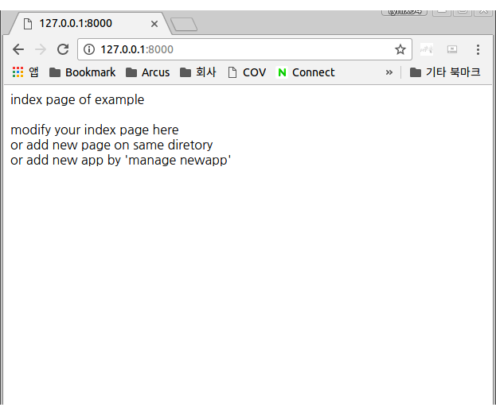

# orca sonar

Sonar is a web development framework of orca programming language. It seems like the django of python. This document tells basic usage of sonar.

Sonar is a framework but it uses html & orm library of orca because those libraries can be used alone. The sonar doesn't remake those functions again. 

The sonar is made as light weight framework and be included in default basic libraries of orca. You don't need to setup sonar. Just type like below to make new project.

```
~$ orca sonar create example
~$ ls example
	~$ cd example/
~/example$ ls -alh
합계 28K
drwxrwxr-x  4 lynix lynix 4.0K  4월 20 11:06 .
drwxr-xr-x 33 lynix lynix 4.0K  4월 20 11:06 ..
drwxrwxr-x  2 lynix lynix 4.0K  4월 20 11:06 example.orca
-rw-rw-r--  1 lynix lynix   92  4월 20 11:06 manage.orca
-rw-rw-r--  1 lynix lynix   14  4월 20 11:06 settings.orca
drwxrwxr-x  2 lynix lynix 4.0K  4월 20 11:06 static
-rw-rw-r--  1 lynix lynix  162  4월 20 11:06 urls.orca
```

The new project 'example' is created.
You can see below files in example project folder.

urls.orca map url with handler.
A static folder serves static resources like js, image and etc.
settings.orca is for setting.
manage.orca provides basic management of web daemon.

An example is a default app folder of project with same name. You can add more app by type 'orca manage newapp example2'.


```
~/example$ orca manage newapp example2
newapp example2 is created
~/example$ ls
example.orca   manage.kw    settings.orca  urls.orca
example2.orca  manage.orca  static

```

Orca make file as object, and also it make folder as an object if it has prefix .orca in its name. The example.orca became an object and files in it become members of an example object.

Let's run example project like below.

```
~/example$ orca manage runserver 127.0.0.1:8000
runserver...
127.0.0.1:8000
server start...
## httpd start: ( '127.0.0.1:8000' )
```




index.orca.html is shown on page.

The urls.orca is written like below,

```
using sonar.core;
using sonar.contrib.admin;
using example;

core.url_map =  {   r'^admin':admin.page,
                    r'':example.index,
                    # add other url map here
                };
```

The regular expression of the url_map match default page as the example.index.
Contents of files in the example.orca folder is like below.


```
~/example$ cd example.orca/
~/example/example.orca$ ls -alh
합계 24K
drwxrwxr-x 2 lynix lynix 4.0K  4월 20 11:16 .
drwxrwxr-x 5 lynix lynix 4.0K  4월 20 11:16 ..
-rw-rw-r-- 1 lynix lynix  246  4월 20 11:16 index.kw
-rw-rw-r-- 1 lynix lynix  199  4월 20 11:06 index.orca.html
-rw-rw-r-- 1 lynix lynix   63  4월 20 11:16 models.kw
-rw-rw-r-- 1 lynix lynix   42  4월 20 11:06 models.orca

~/example/example.orca$ cat index.orca.html

<html>
<head>
</head>
<body>

using sonar;

index page of example<br><br>
modify your index page here<br>
or add new page on same diretory<br>
or add new app by 'manage newapp'<br>

</body>
</html>
~/example/example.orca$ 
~/example/example.orca$ cat models.orca

using sonar;

# Create your models here.

```

index.orca.html is html context extended object (see tutorial.md and 10min.md) which represent web page. The models.orca file defines orm models of example app.


A sample orca sonar project is located in below address.

https://github.com/lynix94/sonar-example

You can see below page if you run this project.


Each example links are ex1 ~ ex7 apps and those are located in ex1.orca ~ ex7.orca.

```

using sonar.core;
using sonar.contrib.admin;
using example;
using ex1;
using ex2;
using ex3;
using ex4;
using ex5;
using ex6;
using ex7;

core.url_map =  {   r'^admin':admin.page,
                    r'':example.index,
                    r'^ex1':ex1.index,
                    r'^ex2':ex2.index,
                    r'^ex3':ex3.index,
                    r'^ex4':ex4.index,
                    r'^ex4_write':ex4.write,
                    r'^ex4_read':ex4.read,
                    r'^ex5':ex5.index,
                    r'^ex5_write':ex5.write,
                    r'^ex5_read':ex5.read,
                    r'^ex6':ex6.index,
                    r'^ex7':ex7.index,
                    # add other url map here
                };
```

The urls.orca is changed like above.

More articles & video clips about sonar will be added later.


