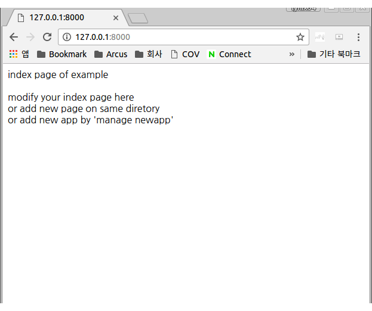

# orca sonar

sonar 는 오르카의 웹개발 프레임웍으로 python 의 django 에 대응한다. 본 문서는 sonar 에 대한 기본 구동 및 사용방법에 대해 간략히 기술한다.
sonar 는 웹 개발 프레임웍이나, html 렌더링이나 스크립트 처리, orm 처리등은 오르카의 기본 라이브러리의 것을 사용한다. 기존 html, orm 모듈이 직교성이 높고 독립적으로 사용할 수 있기 때문에 자체적으로 해당 기능을 구현하지 않았다.

때문에 sonar 자체가 경량이며 오르카 기본 라이브러리에 포함되어 있다.
오르카가 설치되어 있으면 별도로 설치할 필요가 없고 웹 프로젝트를 만들 페이지에서 다음과 같이 입력하면 된다.


```
~$ orca sonar create example
~$ ls example
	~$ cd example/
~/example$ ls -alh
합계 28K
drwxrwxr-x  4 lynix lynix 4.0K  4월 20 11:06 .
drwxr-xr-x 33 lynix lynix 4.0K  4월 20 11:06 ..
drwxrwxr-x  2 lynix lynix 4.0K  4월 20 11:06 example.orca
-rw-rw-r--  1 lynix lynix   92  4월 20 11:06 manage.orca
-rw-rw-r--  1 lynix lynix   14  4월 20 11:06 settings.orca
drwxrwxr-x  2 lynix lynix 4.0K  4월 20 11:06 static
-rw-rw-r--  1 lynix lynix  162  4월 20 11:06 urls.orca
```

example 이라는 새로운 소나 프로젝트가 생성되었다.
해당 프로젝트에 들어가면 위와 같은 파일들이 생성되어 있다.

urls.orca 는url 맵핑을 하고,
static 폴더는 js, image 등의 static 리소스 서빙을 하는 폴더이며
settings.orca 는 설정을,
manage.orca 는 구동 및 관리를 수행한다.

example 은 app 폴더인데, 프로젝트 이름과 동일한 app 폴더가 기본으로 생성되며, 추가로 생성할 때는 다음과 같이 orca manage newapp example2 를 실행한다.


```
~/example$ orca manage newapp example2
newapp example2 is created
~/example$ ls
example.orca   manage.kw    settings.orca  urls.orca
example2.orca  manage.orca  static

```

참고로 오르카는 파일도 하나의 객체로 인식하는데 그치지 않고, 폴더도 이름끝에 .orca 가 붙어있으면 객체로 정의된다고 인식된다. example.orca 는 example 객체로 생성되며 그 안의 orca 폴더들은 이 객체의 멤버로 등록된다.

먼저 이상태에서 서버를 구동해보자.

```
~/example$ orca manage runserver 127.0.0.1:8000
runserver...
127.0.0.1:8000
server start...
## httpd start: ( '127.0.0.1:8000' )
```




example.orca 의 index.orca.html 의 값이 표시되었다.
urls.orca 를 보면 다음과 같이 정의 되어 있는데,

```
using sonar.core;
using sonar.contrib.admin;
using example;

core.url_map =  {   r'^admin':admin.page,
                    r'':example.index,
                    # add other url map here
                };
```

정규표현식으로 특정 url 이 없으면 example.index 가 나오도록 되어있다.

example.orca 폴더의 내용은 아래와 같다.


```
~/example$ cd example.orca/
~/example/example.orca$ ls -alh
합계 24K
drwxrwxr-x 2 lynix lynix 4.0K  4월 20 11:16 .
drwxrwxr-x 5 lynix lynix 4.0K  4월 20 11:16 ..
-rw-rw-r-- 1 lynix lynix  246  4월 20 11:16 index.kw
-rw-rw-r-- 1 lynix lynix  199  4월 20 11:06 index.orca.html
-rw-rw-r-- 1 lynix lynix   63  4월 20 11:16 models.kw
-rw-rw-r-- 1 lynix lynix   42  4월 20 11:06 models.orca

~/example/example.orca$ cat index.orca.html

<html>
<head>
</head>
<body>

using sonar;

index page of example<br><br>
modify your index page here<br>
or add new page on same diretory<br>
or add new app by 'manage newapp'<br>

</body>
</html>
~/example/example.orca$ 
~/example/example.orca$ cat models.orca

using sonar;

# Create your models here.

```

페이지에 해당하는 index.orca.html 과 멤버에 해당하는 orm 모델을 정의하는 models.orca 파일이 있다. 현재는 비어있는데 이 파일들은 각각 index, models 라는 멤버로 example 객체에 추가된다.


소나에 대한 기본 예제를 담고있는 sonar example 프로젝트의 github 주소는 아래와 같다.

https://github.com/lynix94/sonar-example

해당 프로젝트를 구동한 후 구동시키면 아래와 같은 화면이 나타난다.


개별 example 링크는 ex1 ~ ex7 의 app 에 해당되며 해당 app 의 내용은 ex1.orca ~ ex7.orca 안에서 볼 수있다.

```

using sonar.core;
using sonar.contrib.admin;
using example;
using ex1;
using ex2;
using ex3;
using ex4;
using ex5;
using ex6;
using ex7;

core.url_map =  {   r'^admin':admin.page,
                    r'':example.index,
                    r'^ex1':ex1.index,
                    r'^ex2':ex2.index,
                    r'^ex3':ex3.index,
                    r'^ex4':ex4.index,
                    r'^ex4_write':ex4.write,
                    r'^ex4_read':ex4.read,
                    r'^ex5':ex5.index,
                    r'^ex5_write':ex5.write,
                    r'^ex5_read':ex5.read,
                    r'^ex6':ex6.index,
                    r'^ex7':ex7.index,
                    # add other url map here
                };
```

urls.orca 는 위와 같이 추가되었고, 개별 페이지들은 해당 app 에서 볼수 있다.
소나에 대한 자세한 내역은 문서 및 동영상 클립으로 계속 추가할 예정이다.


