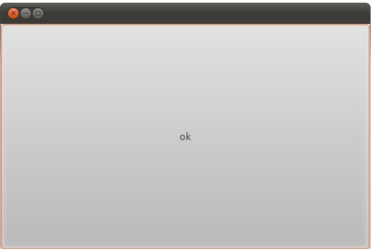
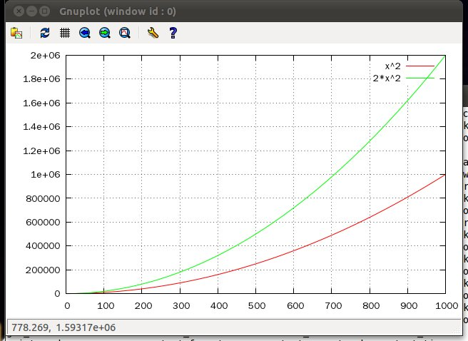
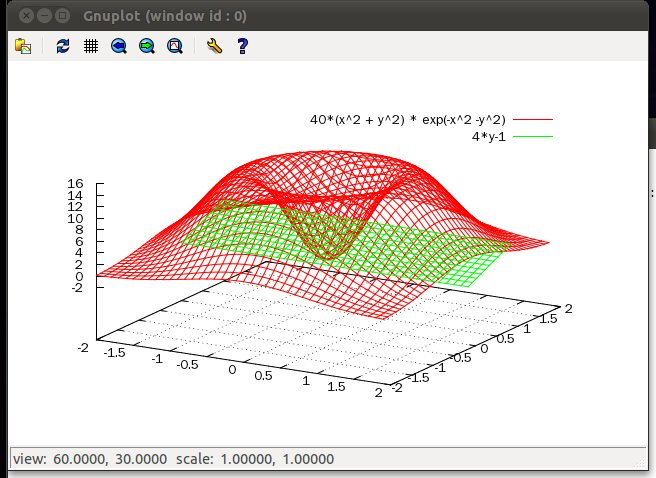

Orca Programming Language Module Reference
==========================================

version 0.5
-----------

written by Lee, Ki-Yeul (kiyeul.lee@gmail.com)  
visit http://orca-lang.or.kr for more information.

Table of Contents
=================

*   [io](#io)
*   [file](#file)
*   [thread](#thread)
*   [ipc](#ipc)
*   [socket](#socket)
*   [select](#select)
*   [alg](#alg)
*   [type](#type)
*   [xml](#xml)
*   [json](#json)
*   [os](#os)
*   [system](#system)
*   [math](#math)
*   [operator](#operator)
*   [sort](#sort)
*   [fun](#fun)
*   [gui](#gui)
*   [datetime, date, time](#datetime)
*   [gnuplot](#gnuplot)
*   [remotec, remoted, dist](#remotec)
*   [fs, dfsd, cached](#fs)
*   [lisp](#lisp)
*   [cpp](#cpp)
*   [sh](#sh)
*   [httpd](#httpd)
*   [base64](#base64)
*   [stopwatch](#stopwatch)
*   [orca](#orca)
*   [util](#util)
*   [run](#run)
*   [cgi](#cgi)
*   [mysql](#mysql)

io
==

This module handle Input and Output.  

### print(...)

Prints out arguments.  
It's absolute module path is root.io.print but for conveniance, It's already in using space.  

### put(...)

This interface is similar with io.print. But, this interface don't change line.

### open(filename, mode)

First argument is file name and Second argument is open mode (like fopen in C) It open file and return file object. (in next chapter)

### input()

Read from console.  

$ name=io.input();
KY Lee
$ print: 'hello, ', name;
hello, KY Lee

file
====

Manage file by using read, write and close interface.  
Here is simple example.  

input = 'hello, file';
fh = open('test.txt', 'w');
fh.write(input);
fh.close();

fh = open('test.txt', 'r');
output = fh.read();
fh.close();

seek(offset, base) change file pointer. offset is size to move.  
base is string like 'SEEK\_SET', 'SEEK\_CUR', 'SEEK_END' which means first, current, end of file.  
tell() returns current file pointer position.  

thread
======

This supports thread.  
run interface launch thread and return thread handle.  
You can join thread by using thread.join interface.  

using thread;

def foo(param) {
  print: param;
}

hd = thread.run(my.foo, \\A1\\AEhello, thread\\A1\\AF);
hd.join();

First argument is object which be a new thread. others are paremeter to passing.  

ipc
===

This supports IPC. currently mutex, cond and semaphore is made up.  

mutex
-----

It supports lock and unlock interface.  
If you run below code,

using ipc;
using thread;
using time;

def sample_thread(num, mtx) {
    print: 'thread: ${num} start';    
    mtx.lock();
    print: 'thread: ${num} accuire mutex';    
    time.msleep(3000);
    mtx.unlock();
    print: 'thread: ${num} release mutex';    
    print: 'thread: ${num} end';    
}

m = clone ipc.mutex;

th1 = thread.run(my.sample_thread, 1, m);
th2 = thread.run(my.sample_thread, 2, m);
th1.join();
th2.join();

It's result is

thread: 1 start
thread: 2 start
thread: 1 accuire mutex
thread: 1 release mutex
thread: 2 accuire mutex
thread: 1 end
thread: 2 release mutex
thread: 2 end

mutex is scope object, so it could be used like below.  

a = mutex.clone();

a {
  fh.write('exclusive write'); 
}

cond
----

### signal()

### wait(mutex, \[msec\]) wait(\[msec\])

It's conditional variable and provides wait and signal interface.  

wait can get relative mutex which handle critical section. and it can get msec to determine waittime. If it's omitted, wait infinitely.  
If you run below example, wait_thread wake up after 1 sec.  

using time;

def wait_thread(cond) {
    print: 'thread: wait';
    cond.wait(3000);
    print: 'thread: wakeup';
}

def signal_thread(cond) {
    time.msleep(1000);
    cond.signal();
}

c = clone ipc.cond;

th1 = thread.run(my.wait_thread, c);
th2 = thread.run(my.signal_thread, c);
th1.join();
th2.join();

semaphore
---------

This module is semaphore and provides set, inc and dec interface.  
By using set, set up key and semaphore max value. And using semaphore by inc and dec.  
If you run below code,

using ipc;
using thread;
using time;

def inc_thread(key) {
    sem = clone ipc.semaphore;
    sem.set(key, 10);
    for a in \[1..10\]: {
        print: 'produced...';
        sem.inc();
        time.msleep(1000);
    }
}

def dec_thread(key) {
    sem = clone ipc.semaphore;
    sem.set(key, 10);
    for a in \[1..10\]: {
        sem.dec();
        print: 'consumed...';
    }
}

th1 = thread.run(my.inc_thread, 1000);
time.msleep(3000);
th2 = thread.run(my.dec_thread, 1000);
th1.join();
th2.join();

It's result is

produced...
produced...
produced...
produced...
consumed...
consumed...
consumed...
consumed...
produced...
consumed...
produced...
consumed...
produced...
consumed...
produced...
consumed...
produced...
consumed...
produced...
consumed...

It shows that consumed... occurs after produced...  

socket
======

This module supports socket. but socket option is not developed yet.  

### create()

create socket and return.

$ sock = socket.create();

### send(data)

send data by socket.

$ sock.send('hello, world');

### recv(\[len, \[timeout\]\])

receive data from socket.

$ msg = sock.recv();

### close()

close socket

$ sock.close();

### connect(ip, port)

connect to ip, port.

$ sock = socket.create();  
$ sock.connect('127.0.0.1', 8080);

### bind(port)

socket bind.

$ sock.bind(80);

### listen()

socket listen

$ sock.listen();

### accept()

accept client and return client socket.

$ client = sock.accept(); Here is echo example.  

svr = socket.create();
svr.bind(80);
svr.listen();

do {
    try {
        client = svr.accept();
        msg = client.recv();
        client.send(msg);
    }
    catch {

    }
} while(true);

If you run above code and try below in another console,

$ using socket;
$ sock = socket.create();
$ msg = io.input();
Hello, socket
$ sock.send(msg);
$ print: sock.recv();
Hello, socket

Like above, echo server is worked.  
You can build multiplexing, multithread server by using select, thread module.  
IOCP, async socket and epoll server will be added soon.  

select
======

select have select object in it. because It have epoll object in it later.  
select interface is like below.  
select (read\_list, write\_list, exception_list, sleep) It's simillar like posix sleep API

def server {
    sock = socket.create();

    sock.bind(8080);
    sock.listen();

    while true: {
        fd = select.select(\[sock.get()\], \[\], \[\], 1000);

        if fd\[0\] == \[sock.get()\]: {
            new_cl = sock.accept();

            str = new_cl.recv();
            new_cl.send(str);

            sock.close();
            new_cl.close();
            return;
        }
    }
}

alg
===

alg module is set of general algorithms about container.  
It's inspired from STL algorithm.  

### traverse(obj, fun)

traverse obj and run fun to each items.  

$ using alg;
$ a = \[1,2,3, {4:5, 6:7}, (8,0)\];
$ alg.traverse(a, %c{print: argv\[0\];});
\[ 1,2,3,{ 4:5,6:7 },( 8,0 ) \]
1
2
3
{ 4:5,6:7 }
( 4,5 )
4
5
( 6,7 )
6
7
( 8,0 )
8
0
$

### for_each (begin, end, function)

Run function(item) to every items between begin to end.  
It's simillar to,

for a in a.begin():
{
	function(a());
}

But, you can set end iterator.  

$ using alg;
$ a = \[1..10\];
\[ 1,2,3,4,5,6,7,8,9,10 \]
$ alg.for_each(a.begin(), a.end(), %c{ print: argv\[0\]; });
1
2
3
4
5
6
7
8
9
10
$ 

### for\_each\_iterator(begin, end, function)

for_each interface call function by value. So, if you want change values, It's not suitable.  
In this case, use for\_each\_iterator instead. It calls function by iterator as parameter.  

$ a = \[1..10\];
\[ 1,2,3,4,5,6,7,8,9,10 \]
$ alg.for\_each\_iterator(a.begin(), a.end(), %c{ argv\[0\](argv\[0\]()*2); });
$ print: a;
\[ 2,4,6,8,10,12,14,16,18,20 \]
$ 

### find (begin, end, value)

find interface find value at range of begin to end. If value is exists in that range, return it's iterator.  
If not, return end iterator.  

$ using alg;
$ a = \[1..10\];
\[ 1,2,3,4,5,6,7,8,9,10 \]
$ b = alg.find(a.begin(), a.end(), 5);
listiter <0x98acc38>
$ print: b();
5
$ b = alg.find(a.begin(), a.end(), 20);
listiter <0x98ad2e8>
$ print: b();
uncaugted exception: orca.iter out of range
recent call-stack trace
>\> root (/usr/local/lib/orca/alg.orca 237)              return true;

### find_if (begin, end, function)

find_if simillar to find but, It determinds match if function(item) return true.  
As an example, change above example to find 7's multiplier.  

$ a = \[11..20\];
\[ 11,12,13,14,15,16,17,18,19,20 \]
$ b = alg.find_if(a.begin(), a.end(), %c{ return argv\[0\] % 7 == 0; });
listiter <0x98ae668>
$ print: b();
14

find_if calls function to every item from begin to end. If function return true, return that item's iterator.  

### erase (begin, end)

erase interface erase all items from begin to end.  

$ a = \[1..10\];
\[ 1,2,3,4,5,6,7,8,9,10 \]
$ s = a.begin().next(3);
listiter <0x98afc60>
$ e = a.end().prev(2);
listiter <0x98af870>
$ print: s(), ':', e();
4:9
$ alg.erase(s, e);
$ print: a;
\[ 1,2,3,9,10 \]

### remove (begin, end, val)

remove interface remove all items which is same with val from begin to end.  

$ a = \[1,2,3,2,7,2\];
\[ 1,2,3,2,7,2 \]
$ alg.remove(a.begin(), a.end(), 2);
$ print: a;
\[ 1,3,7 \]

### remove_if (begin, end, function)

remove_if interface remove all items if function(item) return true from begin to end.  
If you want remove all items which are less than 10,

$ a = \[10, 3, 2, 20, 32\];
\[ 10,3,2,20,32 \]
$ alg.remove_if(a.begin(), a.end(), %c{ argv\[0\] < 10; } );
$ print: a;
\[ 10,3,2,20,32 \]

### copy(begin, end, target)

copy interface copy all items between begin and end to target iterator.  

$ a = \[1..10\];
\[ 1,2,3,4,5,6,7,8,9,10 \]
$ b = \[\];
\[  \]
$ alg.copy(a.begin(), a.end(), b.begin());
$ print: b;
\[ 1,2,3,4,5,6,7,8,9,10 \]
$ alg.copy(a.begin(), a.end(), alg.find(b.begin(), b.end(), 5));
$ print: b;
\[ 1,2,3,4,1,2,3,4,5,6,7,8,9,10,5,6,7,8,9,10 \]
$ 

### copy_n(begin, n, target)

copy_n interface is similar with copy, but it copy n items from begin to target iterator.  

$ a = \[1..10\];
\[ 1,2,3,4,5,6,7,8,9,10 \]
$ b = \[\];
\[  \]
$ alg.copy_n(alg.find(a.begin(), a.end(), 5), 3, b.begin());
$ print: b;
\[ 5,6,7 \]

### count(begin, end, val)

count interface count items from begin to end whose value is val.  

$ a = \[2, 3, 3, 3, 2, 7, 4\];
\[ 2,3,3,3,2,7,4 \]
$ alg.count(a.begin(), a.end(), 3);
3

### count_if(begin, end, function)

count_if is similar with count, but it count items if return value of function(item) is true.  
So, if you want to count even number, do it like below.  

$ a = \[2,3,3,3,2,7,4\];
\[ 2,3,3,3,2,7,4 \]
$ alg.count_if(a.begin(), a.end(), %c{ return argv\[0\] % 2 == 0; });
3

### equal(begin, end, begin2, function)

equal interface calls function(a, b) whose parameter a comes from each eletement of begin ~ end and b comes from each element of begin2 ~ If all return values are true, equal return truel.  
Otherwise, It returns false.  
As an example, below two lists a and b have different type of items.  
So if you evaluate a == b, it's result is false.  
But you can do type-free compare like below,

$ a = \[1, 2, 3, 2, 2\];
\[ 1,2,3,2,2 \]
$ b = \['1', '2', '3', '2', '2'\];
\[ '1','2','3','2','2' \]
$ alg.equal(a.begin(), a.end(), b.begin(), %c{ return argv\[0\] == argv\[1\].integer(); });
true

### equal_range(begin, end, val)

equal_range check all items between begin and end are same value val.  

$ a = \[1,1,2,2,3,3,4,4\];
\[ 1,1,2,2,3,3,4,4 \]
$ alg.equal_range(a.begin(), a.end(), 1);
false
$ alg.equal_range(a.begin().next(2), a.begin().next(4), 2);
true

### replace(begin, end, from, to)

replace interface change items whose value is 'from' to 'to' at the range of begin ~ end.  
Below example show replace 0 to 3.  

$ a = %\[x%3|x<-1~10\];
\[ 1,2,0,1,2,0,1,2,0,1 \]
$ alg.replace(a.begin(), a.end(), 0, 3);
$ print: a;
\[ 1,2,3,1,2,3,1,2,3,1 \]

### replace_if(begin, end, function, to)

replace_if interface is similar with replace, but it change item if function(item)'s result is true.  
Below example show that replace_if change 3's multiplier to X

$ a = \[1..10\];
\[ 1,2,3,4,5,6,7,8,9,10 \]
$ alg.replace_if(a.begin(), a.end(), %c{ return argv\[0\]%3 == 0; }, 'x');
$ print: a;
\[ 1,2,'x',4,5,'x',7,8,'x',10 \]

### transfrom(begin, end, dest, function)

### transfrom(begin, end, begin2, des, function)

transform interface has two types.  
First, transform(begin, end, dest, function) method calls function(item) to all items from begin to end and insert it's result to dest iterator.  

$ a = \[1..10\];
\[ 1,2,3,4,5,6,7,8,9,10 \]
$ b = \[\];
\[  \]
$ alg.transform(a.begin(), a.end(), b.begin(), %c{ return argv\[0\]*10; });
$ print: b;
\[ 10,20,30,40,50,60,70,80,90,100 \]

Above example is multiply 10 to all items and insert them to b; transform(begin, end, begin2, des, function) is similar with above but it has two sources. begin~end and begin2~.  
It inserts the results of function(item1, item2) to dest iterator.  

$ a = \[1..10\];
\[ 1,2,3,4,5,6,7,8,9,10 \]
$ b = %\[x|x<- 100~ \];
\[ 100,101,102,103,104,105,106,107,108,109, ... \]
$ using alg;
$ c = \[\];
\[  \]
$ alg.transform(a.begin(), a.end(), b.begin(), c.begin(), %c{ return argv\[0\] + argv\[1\]; });
$ print: c;
\[ 101,103,105,107,109,111,113,115,117,119 \]

Above example sum up each item from a and b, then insert it to c.  
List b is set-builder form list and it's length is infinite. But range is just a.begin() ~ a.end() because source one has finite range.  

type
====

This is module for type traits and make type dynamically. first, make data type at runtime like below, $ print: type.list(1,2,3); \[ 1,2,3 \] $ print: type.tuple(); ( ) $ print: type.map(1,2,3,4); { 1:2,3:4 } $ str = '\[0-9\]+'; $ print: a = type.regex(str); r'\[0-9\]+' $ print: a == '12345'; true

without type.regex() programmer can make regular expression from constatant string only. (like r'\[0-9\]+'). but type.regex(str) allow to make dynamically.

And, members of type is type type of each data type. So, you can use those for type check.

$ 1.type == type.int;
true
$ 'string'.type == type.string;
true
$ 1.34.type == type.int;
false
$ 

xml
===

xml module can endode & decode xml string.  
It's made by decode statements. and It's purpose is demonstration of decode statement.  
so if you use cxml module (which may be out at later release) that use libxml, It'll be more faster than this.  

### xml.decoding(string)

decode xml string to orca data structure,

### xml.encoding(obj)

encode orca data structure to xml stringl.  

### xml.beutify(obj)

is similar with encoding but, It prints out more readable format.  
string to orca data structure encoding/ decoding rule is like below example.  
If input string is like this,

str = '''
<?xml version="1.0"?>
<tag_a>
<tag\_b attr1="value1" attr2="value2">text of tag b</tag\_b>
</tag_a>
''';

this xml string is convered to

{ '$info':'xml version="1.0"',
   'tag_a':{ 
		    'tag_b':{ '$attrs':{ 'attr1':'value1','attr2':'value2'  },'$text':'text of tag b' } 
                }
}

It is based on xml path structure, one node (tag_a) has it's name key and It's value is child nodes.  

And there is special nodes whose name is $attrs, $text, $info, $attrs is attributes in node, $text is tag value and $info is document information.  

basic rule is like above, but orca map doesn't allow multiple key values. but xml node could be repeated. so if there is same key value in xml string, orca xml decode it as tuple.  
Let's see below example,

str = '''
<?xml version="1.0"?>
<tag_a>
<tag\_b attr1="value1" attr2="value2">text of tag b</tag\_b>
<tag\_b>text of tag b 2nd</tag\_b>
</tag_a>
''';

In this case xml module change it as below,

{ '$info':'xml version="1.0"',
  'tag\_a':{ 'tag\_b':( { '$text':'text of tag b 2nd' },
			        { '$attrs':{ 'attr1':'value1','attr2':'value2' },'$text':'text of tag b' } )
	       } 
}

like above, multiple tag_b nodes are represented as tuple.  
after decoding, You can find node lists in tag_a like this,

ret = xml.decoding(str);

ret\['tag\_a'\].keys(); and you can access child nodes like this, ret\['tag\_a'\]\['tag_b'\]\[1\]\['$text'\] search in xml data structure may be provided at later release.  
and You can encoding from orca structure to xml string by xml.encoding

xml.encoding(ret)

<? xml version="1.0" ?><tag\_a><tag\_b >text of tag b 2nd</tag\_b><tag\_b attr1=value1 attr2=value2 >text of tag b</tag\_b></tag\_a>

but, this result is not easily readable.  
so, use xml.beutify,

<? xml version="1.0" ?>
<tag_a>
        <tag_b >
                        text of tag b 2nd
        </tag_b>
        <tag_b attr1=value1 attr2=value2 >
                        text of tag b
        </tag_b>

</tag_a>

than you can get indented result string.  

json
====

json module can encoding & decoding of json like xml module.  

### json.decoding(str)

decoding json string to orca data structures.  

### json.encoding(obj)

encoding orca data structure to json string.  

### json.beutify(obj)

This also encode to json string but this make more readable string.  
conversion rules are like below, json dectionanry is converted to orca map, json array is converted to orca list, and like xml, json dictionary can have multiple key value so like xml module, orca json module converts it as orca tuple.  
for an example if json string is like this,

  str = "{ 'a':3, 'b':6, 'c':\[1,2,3, { 'a':{'b':'c'}, 'd':\[1,2,3\], 'd':3 },   4,5,6\] }";

ret = json.decoding(str);

this result is

{ 'a':3,'b':6,'c':\[ 1,2,3,{ 'a':{ 'b':'c' },'d':( \[ 1,2,3 \],3 ) },4,5,6 \] }

It's almost same shape but 'd' had been repeated so it's value is tuple like (\[1,2,3\], 3) and now, if you want to see value of 'c' you can access it like print: ret\['c'\]; and like xml module, search in json structure will be provided at later release.  
And you can encdoing to json string from orca data structure by this, str = json.encoding(ret); and result is

{'a':3,'b':6,'c':\[1,2,3,{'a':{'b':'c'},'d':\[1,2,3\],'d':3},4,5,6\]}

and threre is another encoding function beutify which make more readable result.  
print: str = json.beutify(ret) this prints out below,

        {'a':3,
        'b':6,
        'c':    \[1,
                2,
                3,
                        {'a':   {'b':'c'},
                        'd':    \[1,
                                2,
                                3\],
                        'd':3},
                4,
                5,
                6\]}

os
==

### run(cmd)

run excutes argument. It's seem like popen.  

$ using os;
$ os.run(\\A1\\AEls\\A1\\AF);

This prints out file lists.  
And for convenience, It could be like below.  

$ ; ls -al

If semi-colon is in front of string. It is same as or.run(string) ;ls -al is equal to os.run('ls -al'); And It supports call-back reference by using caller.  

$ def \_\_cout\_\_;
$ ; ls -al    
total 2924
drwxrwxrwx+ 10 MYHOME \\BE\\F8\\C0\\BD       0 Dec  1 14:56 .
drwxrwxrwx+ 24 MYHOME \\BE\\F8\\C0\\BD       0 Nov 27 11:01 ..
drwxrwxrwx+  6 MYHOME \\BE\\F8\\C0\\BD       0 Dec  1 02:11 .svn
-rw-rw-rw-   1 MYHOME \\BE\\F8\\C0\\BD       8 Nov  8 17:26 BUILD_NUMBER
-rw-rw-rw-   1 MYHOME \\BE\\F8\\C0\\BD   18007 Nov  8 17:26 COPYING
\\A1\\A6.
$ print: my.\_\_cout\_\_;
\[ 'total 2924
','drwxrwxrwx+ 10 MYHOME \\BE\\F8\\C0\\BD       0 Dec  1 14:56 .
','drwxrwxrwx+ 24 MYHOME \\BE\\F8\\C0\\BD       0 Nov 27 11:01 ..
','drwxrwxrwx+  6 MYHOME \\BE\\F8\\C0\\BD       0 Dec  1 02:11 .svn
','-rw-rw-rw-   1 MYHOME \\BE\\F8\\C0\\BD       8 Nov  8 17:26 BUILD_NUMBER

','-rw-rw-rw-   1 MYHOME \\BE\\F8\\C0\\BD   18007 Nov  8 17:26 COPYING
\\A1\\A6

like above, If there is \_\_cout\_\_ object in caller object, print results are appended in it.  

### getenv(name)

It inquries environment variable.  

$ print: os.getenv(\\A1\\AEPATH\\A1\\AF);

This return the PATH of current shell.  

### cwd()

Return current working directory.  

$ print: os.cwd();
/root/curr

### mkdir(path)

Make new directory

$ 
$ os.mkdir('newdir');
$ 
$ os.cd('newdir');
$ print: os.ls('.');
\[ \]
$ 

### rename(src, dest)

Rename file.  

$ print: os.ls('.');
\[ \]
$ os.mkdir('newdir');
$ print: os.ls('.');
\[ './newdir' \]
$ os.rename('newdir', 'renamed_dir');
$ print: os.ls('.');
\[ './renamed_dir' \]
$ 

### copy(src, dest)

copy file

$ print: os.ls('.');
\[ './file_a' \]
$ os.copy('file\_a', 'file\_b');
$ print: os.ls('.');
\[ './file\_b','./file\_a' \]
$ 

### remove(name)

remove file

$ print: os.ls('.');
\[ './file_a' \]
$ os.remove('file_a');
$ print: os.ls('.');
\[ \]
$ 

### ls()

return file lists.  
return type is list.  

$ os.cd('/usr');
$ print: os.ls('.');
\[ './tmp','./include','./kerberos','./local','./bin','./games','./sbin','./share','./lib','./src','./etc','./libexec' \]
$ 

### cd(path)

change directory

$ os.cd('/usr');
$ print: os.ls('.');
\[ './tmp','./include','./kerberos','./local','./bin','./games','./sbin','./share','./lib','./src','./etc','./libexec' \]
$ 

### isexists(path)

If file or directory exists, return true

$ print: os.isexists('/etc');
True
$ print: os.isexists('/etc/passwd');
True
$ print: os.isexists('/if\_not\_exist');
False
$ 

### isfile(path)

If argument path is file, return true.  

$ print: os.isfile('/etc/passwd');
True
$ 
$ print: os.isfile('/etc');
False
$ 
$ print: os.isfile('/if\_not\_exist');
False
$ 

### isdir(path)

If argument path is directory, return true.  

$ print: os.isdir('/etc');
True
$ print: os.isdir('/etc/passwd');
False
$ print: os.isdir('/if\_not\_exist');
False
$ 

### dir_iterator(path)

This return iterator object which iterates all files in directory.  

$ os.cd('/etc');
$ for a in os.dir_iterator('.'):
\* print: a;
\* 
./printcap
./terminfo
./rc2.d
./bash_completion.d
...

### dir_traverser(path)

dir_iterator iterates only current directory's file.  
dir_traverser traverse tree.  

$ for a in os.dir_traverser('/etc/yum'):
\* print: a;
\* 
/etc/yum/pluginconf.d
/etc/yum/pluginconf.d/blacklist.conf
/etc/yum/pluginconf.d/whiteout.conf
/etc/yum/pluginconf.d/refresh-packagekit.conf
$

### read(filepath, size, offset)

read file contents of filepath and return as string.  
If there is size as parameter, read only size from file.  
If there is offset as parameter, read from offset of file.  

### write(filepath, data, offset)

writes data to file.  
If there is offset as paremeter, write from offset of file.  

### file_size(filepath)

return size of file

### last\_write\_time(filepath)

return last write time as datetime

$ os.write('foo.txt', 'hello, file');
$ print: os.read('foo.txt');
hello, file
$ print: os.file_size('foo.txt');
11
$ print: os.last\_write\_time('foo.txt');
2010-11-14T15:16:51

system
======

system module is for checking system info.  
It provides below interfaces.  

### cpu_n()

This interface return the number of cpu core in the system.  
You can use this at parallel foy by or other parallel adaptive work.  

### free()

This interface returns available memory.  

### memory()

This interface returns physical memory.  

### os()

This interface returns Operating System info as a string.  

### version()

This interface returns orca version as a string.  

$ system.cpu_n();
4
$ system.free();
1422434304
$ system.memory();
2002993152
$ system.os();
Linux version 2.6.35-22-generic (buildd@rothera) (gcc version 4.4.5 (Ubuntu/Linaro 4.4.4-14ubuntu4) ) #33-Ubuntu SMP Sun Sep 19 20:34:50 UTC 2010

$ system.version();
0.5

math
====

math module is wrapper of c math library.  
It provides below interfaces.  

acos, asin, atan, atan2, ceil, cos, cosh, exp, fabs, floor, fmod, frexp, ldexp, log, log10, modf, pow, sin, sinh, sqrt, tan, tanh

Interface and spec of each member is same as libm.  
But, some of above function in c has two output (one by return and the other by parameter pointer) but, orca has no pointer.  
so, in that case return values are returned as one tuple.  
You can see each example at tests/test_math.orca.  

operator
========

operator module is used for lisp module and other functional programming.  

It has +, -, *, /, %, <, <=, >, >=, ==, !=, ||, && members.  
These members are composed by special characters. So, you should refer them with ' ' like below,

$ operator.'+'(3, 4);
7
$ operator.'-'(3, 4);
-1
$ operator.'*'(3, 4);
12
$ operator.'%'(3, 4);
3
$ operator.'<='(3, 4);
true

These function is infix operator. So, if you want to apply them to more parameters at once, use fun.reduce or fun.apply.  

sort
====

sort module is interface for sort container (list or tuple) It make sorted container from input a and return it.  
original container is not changed.  

fun
===

This moule is made for high-order functional programming.  
This provides below interfaces.  

### map(iteratable, f)

run f to each member of iteratable.  
and make list from each results of that.  

$ using fun;
$ ret = fun.map(\[1,2,3\], %c{ return argv\[0\] * 2; } );
$ print: ret;
\[ 2,4,6 \]

above code works like \[ 1 * 2, 2 * 2, 3 * 2\]

### reduce(iteratable, fun, initial)

make accumulative result of fun to each item of iteratable.  
use initial as initila value if it is exists or set first item as initial value.  
belows are sum up example.  

$ using fun;
$ print: fun.reduce(\[1,2,3,4,5\], %c{ return argv\[0\] + argv\[1\]; });
15

argv\[0\] are accumulative result and argv\[1\] is each member of list so, above code works like ((((1 + 2) + 3) + 4) + 5)

### bind_1st(fun, arg)

bind first paramter of fun as arg

def mul(a, b) 
{
	return a * b;
}

mul10 = fun.bind_1st(..mul, 10);

In above case,

$ print: mul10(2);
20
$ print: mul10(2.4);
4.8

new mul10 function which binds 10 to mul is created.  
bind\_2nd, bind\_3rd are similar with bind\_1st but bind arg to 2nd and 3rd paremeter and fun.bind\_nth(fun, arg, n) bind arg to n 'th paremter of fun.  

### apply(f, list)

call f with list elements as paremeters as an example, fun.apply(foo, \[1,2,3\]) call foo(1,2,3)

gui
===

gui module support GUI interface. gui module use flexible relationship of orca object.

  def main : window
   {
       my.attr\['wh'\] = (800, 600);
   
       def box : vbox
       {
           def menu : menubar
           {
               file = \[ 'open', %c{
                                   name = dialog.fileopen(upper('main'));
                                   str= os.read(name);
                                   upper('box').hs.edit.attr\['text'\] = str;
                               },
                       'save', %c{
                                   str= upper('box').hs.edit.attr\['text'\];
                                   name = dialog.filesave(upper('main'));
                                   os.write(name, str);
                               },
                       'exit', %c{
                                   upper('main').quit();
                               }
                       \];
   
               my.push_back('file', file);
           }
   
           def hs : scroll
           {
               def edit : text
               {
               }
           }
       }
   }

Above example is simple notepad application. If you do this with Win32 api or GTK API, It should be more complex and bothering. If you use RAD tools for it, Additional representation layer and real code has some gap so it lose intuition.  

But, orca gui module is different. All things in window has it's own object in code. and That objects have same relation. Real object in gui has same logical object in code.  

Lets imagine main window has only one 'ok' button.  
That button is included in window.  

   def main : window
   {
       def box : vbox
       {
           def ok : button
           {
               my.attr\['text'\] = 'ok';
           }
       }
   }

This window is written like above. ok : button is included in main : window (actually, there should be additional container object in window. GTK aspects)

If you launch above main window like this,

my.main.make();
my.main.show();

main window with ok button appears.  
make interface makes window with it's sub objects.  
show interface show result window. result window is like below.  
In this time, We don't define action of ok button. So, Nothing is happened when you click ok button.  
Let's see another example which have click event action.  

  def main : window
   {
       my.attr\['xy'\] = (50, 20);
       my.attr\['wh'\] = (300, 200);
   
       def box : fixed
       {
           def counter : label
           {
               my.attr\['xy'\] = (40, 50);
               my.attr\['text'\] = 0;
           }
   
           def plus : button
           {
               my.attr\['xy'\] = (150, 30);
               my.attr\['wh'\] = (100, 50);
               my.attr\['text'\] = '+';
               my.event\['clicked'\] = %c{
                   upper('box').counter.attr\['text'\] += 1;
               };
           }
   
           def minus : button
           {
               my.attr\['xy'\] = (150, 130);
               my.attr\['wh'\] = (100, 50);
               my.attr\['text'\] = '-';
               my.event\['clicked'\] = %c{
                   upper('box').counter.attr\['text'\] -= 1;
               };
           }
       }
   }

Above example, Window have counter label, plus button which increase counter and minus button which decrease counter. We use box : fixed contaiter. So, we define position attribute my.attr\['xy'\]. And then, GUI event could be defined by set my.event attribute.  

On above code, my.event\['clicked'\] has assigned by lambda code. And then, If you click plus button, GUI make clicked event and it invokes assigned lambda code %c{ upper('box').counter.attr\['text'\] += 1; }.

upper is util.upper interface which traverse owner link and find name is euqal. So, upper.('box').counter means main.box.counter. And lambda code increase counter text by 1. so label text of counter is changed.  

Result window is like this,  

This simple but impressive exmaple shows that all the object in the window and there relation and events can move to code exactly.  
Below gui objects are supported in current version.  

*   window : top level window widget.  
    
*   button : button
*   check : check button
*   combo : combo button
*   radio : radio button
*   entry : input entry field
*   fixed : fixed container
*   vbox : vertical container
*   hbox : horizontal container
*   dialog : default system dialog (file open, save)
*   hsep : horizontal seperator
*   image : image
*   label : text label
*   list : list widght
*   menubar : menu
*   scroll : scroll bar
*   statusbar : status bar
*   table : table
*   text : text
*   tree : tree widght

Each object represent different GTK widget. You can inherit above object and set your own attributes and events.  
You can see many example and codes by run tests/test_gui.orca.  

datatime, date, time
====================

These modules maintain time duration & time point.  

datetime is timepoint which has years, months, days, hours, minutes, seconds and microseconds. It points out exact time point.  
Internally, datetime is made up by module date + module time module date is time point(date point).  

module time is time duration "from 00:00:00 AM" dateduration is the interval of two date. (like 2 moth ago, 2 years later) time point is exact time so time points couldn't be added to other time point.  

but It could be substracted from another time points and result is integer which means interval of two timepoints.  
If time points is datetime, interval scale is microsecond.  
and if time points is date, interval scale is day.  

Time duration is amount of time. so it could be added or be substracted to another time duration.  
and It could be multiplied or divided by integer.  

If you add (or sub) time point and time duration, It make new time point which is moved from original time point to amount of time duration.  

Let's see detail interface of each module.  

time
====

time means time durtiaon from 00:00:00 AM. Time of day.  
value is composed by hour, minute, second, microsecond.  

### time.clone(format)

create new time object from format.  

$ print: a = time.clone('01:02:03.4');
01:02:03.400000
$ print: a.hour;
1
$ print: a.minute;
2
$ print: a.second;
3

### time.time\_of\_day()

return current time of day $ print: time.time\_of\_day(); 23:01:33.990408

### time.hours(h)

make duration of h hours

### time.minutes(m)

make duration of m minutes

### time.seconds(s)

make duration of s seconds

### time.microseconds(us)

make duration of us microseconds

$ print: time.clone('01:02:03') + time.hours(3) + time.microseconds(1000);
04:02:03.001000

It's a duration, so each field has no limit.  
(That means, minutes could be more 60) And time could be added or substracted wich integer.  
In this case, integer value means microseconds.  

$ print: a;
01:02:03
$ print: a + 1234;
01:02:03.001234
$ 

time object could be compared to each other.  

$ using time;
$ a = time.clone('01:02:03');
$ b = time.clone('01:02:04');
$ print: a > b;
false
$ print: a == b;
false
$ print: a < b;
true

date
====

date is date point and It is composed by year, month and day

$ using date;
$ print: a = date.clone('2000-01-02');
2000-01-02
$ print: a.year, ' ', a.month, ' ', a.day;
2000 1 2

date.today() return current date.  

$ print: date.today();
2010-11-02

And dateduration is date duration (no date point).  
this dateduration object could be added or substacted to each other.  
and It could be multiplied or diveded with integer.  
but devide means devide each value of attributes (years, monthes, days, weeks) and remainder is lost.  
And add, sub by integer is possible. In this case integer means days.  

$ using date;
$ print: date.years(1);
1 years 
$ print: date.months(2);
2 months 
$ print: date.days(3);
3 days 
$ print: date.weeks(4);
4 weeks 
$ print: a = date.years(3) - date.months(4) + date.weeks(2) - date.days(7);
3 years -4 months 2 weeks -7 days 
$ print: a *= 2;
6 years -8 months 4 weeks -14 days 
$ print: a /= 3;
2 years -2 months 1 weeks -4 days 
$ print: a += 1;
2 years -2 months 1 weeks -3 days 
$ print: a -= 2;
2 years -2 months 1 weeks -5 days 

and now, you can add (or sub) date and dateduration then make new date.  

$ print: date.clone('2000-01-01') + date.months(2);
2000-03-01

substraction between two dates means intervals in days scale.  

$ using date;
$ print: date.clone('2000-01-01');
2000-01-01
$ print: date.today() - date.clone('2000-01-01');
3958
$ print: date.clone('2000-01-01') + 100;
2000-04-10

datetime
========

date + time make datetime object. this means exact time point from date with time duration.  

$ print: date.today() + time.time\_of\_day();
2010-11-02T23:26:12.827502

datetime could be made up by initial string like below, and datetime have internal interface date() and time() which return date or time value of datetime.  
now() means current datetime.  

$ print: datetime.clone('2000-01-02 03:04:05');
2000-01-02T03:04:05
$ print: a = datetime.now();
2010-11-02T23:21:56.685685
$ print: a.date(), ' ', a.time();
2010-11-02 23:21:56.685685

date, time duration could be added or substarcted to datetime.  

$ print: a = datetime.clone('2000-01-01 03:04:05');
2000-01-01T03:04:05
$ print: a + date.years(10) - date.months(30) + time.hours(100) - time.minutes(2000);
2007-07-03T21:44:05

substraction between two datetime means interval of them with microseconds scale.  
and add (or sub) of integer to datetime means increase(or decrease) of microsecond value.  

$ print: a = datetime.clone('2000-01-01 03:04:05');
2000-01-01T03:04:05
$ print: a + 1000000 * 3600 * 24 * 10;
2000-01-11T03:04:05
$ print: a - 10;
2000-01-01T03:04:04.999990
$ print: datetime.clone('2010-01-01 03:04:05') - a;
87672:00:00

And aditionally, time.msleep(msec) is another static function which sleep in msec milliseconds.  

gnuplot
=======

gnuplot module is the wrapper of gnuplot.  
You can use lists as the plot data of gnuplot. Especially, set builder form lists are more useful with gnuplot module.  

### gnuplot.run(cmd)

This interface call gnuplot application as 'cat cmd | gnuplot'. It's most simple wrapper interface.  

### gnuplot.add(title, list)

This interface add 2D plot data to gnuplot's internal data.  
list is 2D format like \[(x1, y1), (x2, y2), ...\]

### gnuplot.plot(cmd);

This interface plot added 2D data plots to screen.  
Before plot graph executes cmd. So, you can pass cmd like 'pause 1'.  

### gnuplot.clear();

This interface clear added graph data in object.  
Below example show x^2 and 2*x^2 graph on the screen.  
plots are connected by line, grid lines are setted. graph appears about 1 sec.  

   a = gnuplot.clone();
   a.clear();
   a.add('x^2', %\[(x, x*x)|x<-1~1000\]);
   a.add('2\*x^2', %\[(x, x\*x*2)|x<-1~1000\]);
   a.set('line');
   a.plot('pause 1');

Result graph image is like below,  

3D graph plot needs 3 data at one point. So, It's differ from 2D plot interface.  

### gnuplot.sadd(title, list, group)

This interface add 3D data to gnuplot object.  
title and list is same as gnuplot.add. And group means line grouping in 3D images for conveniance.  
You can add this parameter as true if (x, y, z) lists are sorted by x, y.  

### gnuplot.splot(cmd)

This interface plot 3D graph using plot data added by sadd.  
s means space.  

   sbf= %\[(x, y, 40*(x\*x + y\*y)\*math.exp(-(x\*x) - (y*y)))|x<--2~2:0.1, y<- -2~2:0.1\];  
   sbf2= %\[(x, y, 4*y-1)|x<- -2~2:0.1, y<- 0~1:0.1\];
  
   gnuplot.sadd('40*(x^2 + y^2) * exp(-x^2 -y^2)', sbf, true);
   gnuplot.sadd('4*y-1', sbf2, true);
   gnuplot.set('grid');
   gnuplot.set('line');
   gnuplot.splot('pause 1');

Above example show z = 40*(x^2 + y^2)\*exp(-x^2-y^2) and z = 4\*y-1 Result graph images are like below,  
 In these example, only SBF lists are used as source data. But, you can use norman lists which are setup by your algorithm or your own module.  

remotec, remoted, dist
======================

This modules supports orca remote and distribute processing.  
first, remoted runs remote server.  

### remoted(port)

remote server stated using port.  

orca remoted 8080
\## dist server start

You can run it from shell prompt like above or run it from script file like remoted(8080) And second, connect to remote server from other machine like below,

$ using remotec;
$ c = remotec.clone('127.0.0.1', 8080);
$ print: c.ping();
true
$

from now on, If you get or set member of c, It works from remote machine !! (It made by .attr, .attr_last, .attr=) let's see detail example.  

$ c.hello = 'hello, remote';
$ print: c.hello;
hello, remote

It's very simple but It doesn't work from local machine. c.hello = 'hello, remote' make root.hello object to remote server.  
print: c.hello read root.hello from remote server and print it.  
cascaded path could be possible.  

$ c.foo.bar = 10;
$ print: c.foo.bar;
10
$

In this case, roo.foo.bar object is created and assigned to 10 of remote node. print: c.foo.bar reads root.foo.bar of remote node.  
and if you referr c.foo.bar only root.foo.bar is read from remote node by socket (not all contents of root.foo) and then, let's call remote function.  
You can set object to remote node like below, (wait, current version doesn't support it from shell inerpreter. you shoud do that from script file)

using remotec;

def sum(...)
{
	return argv\[0\] + argv\[1\];
}

c = remotec.clone('127.0.0.1', 8080);
c.sum = my.sum;
print: c.sum(10, 20);

If you run this script file, It returns 30. You set root.sum from remote node and call it and get result from that.  
But, in this code, client is blocked while result is calculated by remote.  
so If you want non-block working, Do it like below

using remotec;

def sum(...)
{
	return argv\[0\] + argv\[1\];
}

c = remotec.clone('127.0.0.1', 8080);
c.sum = my.sum;
c.sum.\_\_nowait\_\_(10, 20);
print: c.is_done(100);
print: c.pop_obj();

If you add virtual member \_\_nowait\_\_ after function sum, remotec call sum and non-blocking returned.  
and you can check if remote call is done by call is_done(msec).  
isdon(msec) check if remote call is done. In case of void parameter, It return true/false immidiatly.  
if msec is provied as parameter, It wait remote call to msec millisecond.  
After remote call is done, you can get result by calling pop_obj() Above usages are different to other languages because It access remote object like same way of local object.  
and It can move object to remote node with compiled byte codes and call it directly.  
so you can use it like below with remote_do()

using remotec;

c = remotec.clone('127.0.0.1', 8080);
c.remote_do: 10, 20, %c{ 
	return argv\[0\] + argv\[1\]; 
};

print: c.is_done(100);
print: c.pop_obj();

this codes return 30.  
remoted(...) call last argv item with other argv items as paremeters.  
In this example, last argv item is lambda function. It's remote call but very similar with local procedure call.  
In nowdays, Only orca supports above easy and flexible way of remote call processing.  
dist module supports distribute processing environment with remoted lists.  

### dist.add(ip, port)

connect to remoted server and add it to internal list.  

### dist.dist_do(...)

works like remote_do but it select remote node automatically.  

### dist.dist_for(list, fun)

this do disribute processessing with internal remoted lists. main procedure is blocked to all result is calculated.  
It returns result lists.  
Let's see from example.  
below is test_dist.orca whithc is in tests directory of orca as test vector.  
It launches remote node from port, port+1 and port+2 and call dist\_do and dist\_for.  
dist_do call simple sum function to remote node.  
dist_for do distribute processing to list (calculating square of each item)

using remoted;
using remotec;
using dist;
using random;
using time;

random.seed();
port = random.integer(1000) + 8000;

print: '# port: ', port;

parallel do {
	server = remoted.clone();
	server(port);
}

parallel do {
	server = remoted.clone();
	server(port+1);
}

parallel do {
	server = remoted.clone();
	server(port+2);
}

time.msleep(200);

dist.add('127.0.0.1', port);
dist.add('127.0.0.1', port+1);
dist.add('127.0.0.1', port+2);

r = dist.dist_do(10, 20, %c{ return argv\[0\] + argv\[1\]; });
print: r.is_done(100);
print: ret = r.pop_obj();

if ret != 30:
	throw test.dist, 'dist_do failed';

list = \[1..100\];
rs = dist.dist_for(list, %c{ return argv\[0\] * argv\[0\]; } );
print: rs;

if rs != %\[ x*x | x<-1~100 \]:
	throw test.dist, 'dist_for failed';

print: '## now quit: ', dist.shutdown();
return 'OK', my;

belows are result of above. 30 is return as result of dist_do, And you can see square value of each item of \[1..100\] is returnend.  

\# port: 8985
\## dist server start
\## dist server start
\## dist server start
true
30
\[ 1,4,9,16,25,36,49,64,81,100,121,144,169,196,225,256,289,324,361,400,441,484,52
9,576,625,676,729,784,841,900,961,1024,1089,1156,1225,1296,1369,1444,1521,1600,1
681,1764,1849,1936,2025,2116,2209,2304,2401,2500,2601,2704,2809,2916,3025,3136,3
249,3364,3481,3600,3721,3844,3969,4096,4225,4356,4489,4624,4761,4900,5041,5184,5
329,5476,5625,5776,5929,6084,6241,6400,6561,6724,6889,7056,7225,7396,7569,7744,7
921,8100,8281,8464,8649,8836,9025,9216,9409,9604,9801,10000 \]

fs, dfsd, cached
================

This modules are made for distribute file system and distribute cache.  
dfsd is distribute file server node and cached is distribute cache node.  
fs mounts this node to it's file system path.  
but, mount means that it works in orca vm only. It doesn't mean mount file system in OS level.  
dfsd starts with file path which it serve and port num which it listen.  

\[Machine 192.168.0.2\]
$ orca dfsd /home/lynix 8080

\[Machine 192.168.0.3\]
$ orca dfsd /home/orca 8080

You can launche file system node like above.  
and now, mount them by fs.mount(path, ip, port) like below,

fs.mount('/mnt/node_a', '192.168.0.2', 8080); 
fs.mount('/mnt/node_b', '192.168.0.3', 8080); 

after that, data = fs.read('/mnt/node_a/foo/bar.txt');  
above statement read /home/lynix/foo/bar.txt from machine 192.168.0.2 and save to data.  
data = fs.copy('/mnt/node\_a/foo/bar.txt', '/mnt/node\_b/')  
this statement copy /home/lynix/foo/bar.txt of machine 192.168.0.2 to /home/orca of 192.168.0.3.  
but, fs.read('/etc/passwd') reads from local file because it's path is no in mounted list.  
other members of fs is belows.  
mkdir, ls, remove, file_size, isexist, isfile, isdir, read, write, copy, rename this member works like those of os module except if path is mounted It works from file server.  
So if you make program by using fs module (rather than os module), your program is flexible for extenstion to distribute file system or cache.  

### fs.mount\_dist\_dir(path, ...)

mound\_dist\_dir mounts several file server nodes to path. You can mount servers like this,

### fs.mount\_dist\_dir('/mnt/dir', ('192.168.0.1', 8080), ('192,168.0.2', 8081));

and If you call like below,

fs.write('/mnt/dir/file1', 'hello, file'); 
fs.write('/mnt/dir/file2', 'hello, file'); 
fs.write('/mnt/dir/file3', 'hello, file'); 
...

fs hashing path and distributes it to some file server node.  
after that, If you call fs.read('/mnt/dir/file1'); fs read it from server node which had wrotten.  
cached is key-value memory cache server.  
But it has same interface with dfsd and just save contents in memories.  
So, you can mount cached by using fs.mount or fs.mount\_dist\_dir but in this release cached has no function for LRU-reflacement. maybe later release should support that.  

lisp
====

The lisp module is common lisp compiler which is made by parse statement of orca. Because it's made by orca, it's possible and easy to use orca object and module in lisp statement.  
lisp.compile(str) compiles lisp code and make compiled code as tuple.  
If you save this compiled code and use it later, use pack.save() interface and save it as file.  
You can get execution result by call lisp.execute(code).  
Let's see real examples.  
Below example is copmile & excute 3 + (4 * 2) by lisp.  
You can see compiled code in interpreter shell.  

$ ret = lisp.compile('(+ 3 (* 4 2))');
( \[ \[ +,3,\[ *,4,2 \] \] \],{ 'F':false,'T':true,'car':car <0x9d82350>,'cdr':cdr <0x9d823d8>,'do':do_list <0x9d82460>,'list':list <0x9d824e8> } )
$ lisp.execute(ret);
11

lisp module supports defun, macro, let, if, cond and etc...  

$ lisp.execute(lisp.compile('(defun (sum x y) (+ x y) )(sum 4 4)'));
8
$ lisp.execute(lisp.compile('(defmacro (addy x) `(+ ,x y))  (let ((y 20)) (addy 10))'));
30
$ lisp.execute(lisp.compile('( cond ((>= -3 20) (* 3 10))  ((< 20 10) 3)   (T "error") )'));
error

And, lisp code can access orca object. But default namespaces are io and io.print. So, before you use it, register namespace by (using path) statement.  

$ lisp.execute(lisp.compile('(print "hello\\n")'));
hello
lisp.execute(lisp.compile('(using math) (math.sin (/ 30.0 90.0))'));
0.327195

And lisp module supports UDS (user define statement) So, You can use lisp codes in orca source code.  

   def foo := %lisp{
    (\+ argv0 argv1)
   };
   
   print: r = .foo(3, 4);

Above example prints 7. Paremeters that pass to lisu UDS are named as argvN.  
You can see more test examples at test/test_lisp.orca and can see lib/lisp.orca as lisp module source code made by parse statement.  

cpp
===

cpp is user define statement(UDS) module. It helps user to make dynamic extension library easily.  
Orca supports dynamic library which is made by native C++ language. But, this methods are disturbing and have to do a lot of things to make.  

   using cpp;
   
   def sum := %cpp{
	// this is cpp code
       return argv\[0\] + argv\[1\];
   };
   
   
   print: my.sum(10, 20);

If you make above code and run by orca, At first module loading (with compile) native codes in %cpp{ } are compiled by native compiler (gcc or VC++) Then output library is loaded in orca.  

$ ./orca tt
cpp external module compile: g++ -shared -o /tmp/lib\_\_tt\_1\_context.so /tmp/\_\_tt\_1\_context.cpp -I${ORCA\_HOME}/include/orca -L${ORCA\_HOME}/lib -lorca
/usr/bin/ld: cannot find -lorca
30

Then it prints 30. look at the above compile messages.  
orca made /tmp/\_\_tt\_1\_context.cpp file from the cpp UDS of tt.orca. Then invoked native compiler (gcc) to build shared library /tmp/lib\_\_tt\_1\_context.so.  

Result dynamic modules are saved in /tmp/ so you have to add that path to LD\_LIBRARY\_PATH

There are somethings to do before use cpp UDS. But if you set up one time, making native object will be very easy after that.  

The parameters passed to cpp UDS object are vector argv; so, in above example, argv\[0\] and argv\[1\] is struct orcaData (in cpp struct) You can see that struct in src/vm/orcaData.h. And implicit type casting of CPP struct make it easy to use orcaData as orca object.

Below code is \_\_tt\_1_context.cpp. It's generated by orca cpp module from tt.orca.  
You can find native code in udf which is defined at %cpp{ }

 #include "orcaObject.h"
   
       class \_\_tt\_1_context : public orcaObject
       {
       public:
           orcaData udf(orcaVM* vm, vector& argv)
           {
	       // this is cpp code
               return argv\[0\] + argv\[1\];   
           }
   
           orcaData operator()(orcaVM* vm, int param_n)
           {
               vector argv;
               for (int i=0; iget_param(i));
   
               return udf(vm, argv);
           }
       };
   
       #ifdef WINDOWS
       #define EXPORT __declspec(dllexport)
       #else
       #define EXPORT
       #endif
   
       extern "C" EXPORT void* get\_\_\_tt\_1_context()
       {
           \_\_tt\_1\_context* sp = new \_\_tt\_1\_context();
           return sp;
       } 

When you make your own cpp code, Sometimes you have to include header or setup library path.  
At that case,

   def sum := %cpp{
       #include #cflags -I/usr/local
       #ldflags -ltest
   
       return argv\[0\] + argv\[1\];
   }; 

Like above, define #include, #cflags and #ldflags in UDS statement. cpp module copy #include line to top of generated file. And use clfags and ldflags as compile time option.  

In windows envrionment, cpp UDS objects are compiled by vscompile.bat.  
That batch file is made up for Visual c++ express edition 2008. If you use another compiler or there are some problem to build, change that batch file.  

sh
==

sh module is the wrapper of shell script for using at orca's UDS.  
It use os.run interface and pass parameters as argv\[N\] Below example is making sh UDS object tgzip which make tar ball of input directory.  

def tgzip = %sh{ tar -xcvf argv\[0\] argv\[1\] };
my.tgzip('out.tar.gz', '/home/lynix/out');

httpd
=====

This is simple http server.  

### httpd(path, port)

This call launch http server with path as http root and port as http listen port.  
This module use fs module for file management so dfsd and cached could be used for hosting.  
current it supports get, post and multipart post request.  
and if URI is *.orca file, It launch thread and execute it.  
and if URI is *.osp (orca server page), It call osp module to parsing it and launce thread and execute that.  
currently, sample test page is http://orca-lang.or.kr:8080/hello.osp

base64
======

This is base64 encoding & decoding module.  

### base64.enc(str)

do base64 encoding of str.  

### base64.dec(str)

do base64 decoding of str

$ using base64;
$ print: a = base64.enc('12345678');
MTIzNDU2Nzg=
$ print: b = base64.dec(a);
12345678

stopwatch
=========

It's simple stopwatch object.  

start()
-------

Init timer.  

elapse()
--------

return elapsed time as microsecond.  

$ using stopwatch;
$ 
$ stopwatch.start();
$ print: stopwatch.elapse();
15007541
$ 
$ print: stopwatch.elapse();
24143768
$ 

lap(msg)
--------

Prints out elapsed time in console.  

$ sw = stopwatch;
$ sw.start();
$ sw.lap('lap 1: ');
lap 1: 17 sec, 71 ms, 530 us
$ sw.lap();
20 sec, 287 ms, 624 us
$ 

title(msg)
----------

Set up header message of timer.  
After setup, this message is printed when lap() is called.  
title returns stopwatch object.  

$ using stopwatch;
$ sw1 = stopwatch.clone();
$ sw1.title('\[sw1\]');
$ sw2 = stopwatch.clone();
$ sw2.title('\[sw2\]');
$ 
$ sw1.start();
$ sw2.start();
$ sw1.lap();
\[sw1\]5 sec, 792 ms, 273 us
$ sw2.lap();
\[sw2\]5 sec, 855 ms, 888 us
$ sw1.lap('lap1');
\[sw1\]lap122 sec, 128 ms, 36 us
$ sw2.lap('lap2: ');
\[sw2\]lap2: 32 sec, 976 ms, 62 us
$ 

scope\_start, scope\_end
------------------------

It supports scope statement scope\_start is same as start, scope\_end is same as lap.  

$ sw1.title('scope statement test:') { 
\* root.time.msleep(1000);
\* }
\* 
scope statement test:999 ms, 425 us
$

orca
====

This module is for access low-level aspects of orca.  
current version provides load() and unload() interface.  

### load(name)

loads module in runtime.  
str = argv\[0\]; orca.load(str);

### unload(name)

unload module in runtime. It's purpose is reload dynamic pages from http, osp module.  

util
====

This module provides simple utilities.  

### lock(obj)

It make lock by lang.id() of obj. below example lock to obj and make critical section.  
util.lock(obj) { obj.push_back(1); ...  
}

lru
---

lru interface manage lru list. It manage lru by (key, value) pair.

### lru.insert(k, v)

Inserts k, v pair into lru list. v is dest. object which is maintained by lru list k is key which to find v is in or not in.

### lru.victimize()

victimize interface remove oldest one from lru list.

### lru.touch(k)

If k is exist in lru list, return v and move it to first of lru list. If not, return nil.

### lru.size()

size interface return current lru list size.

$ using util.lru;
lru <0x858c230>
$ a = 'string a';
string a
$ lru.insert(a.id(), a);
$ b = 'string b';
string b
$ lru.insert(b.id(), b);
$ c = 'string c';     
string c               
$ lru.insert(c.id(), c);
$ lru.dump();  
string: string c
string: string b
string: string a
$ lru.victimize(); 
$ lru.dump();          
string: string c      
string: string b 

run
===

You can run orca module in shell promt. but you can't run member of module directly in shell prompt.  
That means $ orca foo # possible $ orca foo.bar # impossible But if you use run module, argv\[0\] is path of object which will be called and argv\[1:\] is paremeters so you can use like below, nil of last line is return value.  

$ orca run io.print hello, orca
hello,orca
nil

cgi
===

cgi module is made by libcgi and supports basic CGI programming.  
This module is beta phase so It will have many changes in interface.  
First, describe interface and show basic example.  

get_param(name)
---------------

return request parameter.  

$ var = cgi.get_param('key');
$ print: var;
value

urlenc(src)
-----------

Encoding input string as URL format.  

$ print: cgi.urlenc("if a+3 > 4: print('overflow');");
if+a%2B3+%3E+4%3A+print%28%27overflow%27%29%3B

urldec(src)
-----------

Decoding URL format as original string.  

$ print: cgi.urlenc("if a+3 > 4: print('overflow');");
if+a%2B3+%3E+4%3A+print%28%27overflow%27%29%3B
$ print: cgi.urldec('if+a%2B3+%3E+4%3A+print%28%27overflow%27%29%3B');
if a+3 > 4: print('overflow');

htmlenc(src)
------------

encoding symbol as html escape character.  

redirect(url)
-------------

redirect document.  

header {
  cgi.redirect('another.orca');
}

header
------

cgi.header has session and cookie object.  
cgi.header object is used as scope statement.  
In it's scope, session and cookie setting is possible.  

cgi.header {
  cgi.header.session('session\_name\_a');
     ...
  cgi.redirect('doc.orca');
}

header.session
--------------

session manager object

header.session.add(name, value)
-------------------------------

add new variable in session.  
session.add('new\_key', 'new\_value');

header.session.set(name, value)
-------------------------------

change session variable value.  
session.set('new\_key', 'changed\_value');

header.session.get(name)
------------------------

return session variable value.  
session.get('new_key');

header.session.remove(name)
---------------------------

remove session variable.  
session.remove('new_key');

header.session.exist(name)
--------------------------

check whether session variable is exist.  
session.exist('new_key');

header.session.destroy()
------------------------

destroy the session session.destroy();

cgi.header.cookie
-----------------

cookie manager object.  

header.cookie.get(name)
-----------------------

get cookie value cookie.get('cookie');

header.cookie.set(name, value)
------------------------------

set cookie value cookie.set('cookie', 'value');

html
----

html text generation object.  

html.puts(msg)
--------------

prints text in html document.  
html.puts('text in html');

html.tag
--------

make new tag in html document.  
first parameter is tag name and others are attributes.  

using cgi.html.tag;

tag('html') {
  tag('head') { }
  tag('body') {
    ...  
  }
}

html.ctag
---------

Like , make closed tag

using cgi.html.tag;
using cgi.html.ctag;

tag('html') {
  tag('head') { }
  tag('body') {
    ctag('img', 'src=img.jpg');
  }
}

html.br
-------

print  
in html docuemnt.  

using cgi.html.tag;
using cgi.html.ctag;
using cgi.html.br;

tag('html') {
  tag('head') { }
  tag('body') {
    ctag('img', 'src=img.jpg');
    br();
  }
}

html.text(msg)
--------------

make new font tag.  
First parameter is text which be printed.  
Second parameter is font name.  
Third parameter is size.  

using cgi.html.tag;
using cgi.html.ctag;
using cgi.html.br;

tag('html') {
  tag('head') { }
  tag('body') {
    ctag('img', 'src=img.jpg');
    br();
    text('simple text', 'gulim', 10);
  }
}

Simple login example
====================

Here is simple login example.  
Below file is login.orca.  
It reads name from user and process login.  
For more detail on source, If form is submitted, It called again and makes new session session_test and sets session variable logged as 1.  
Then redirect to result.orca.  

#!/bin/orca

using cgi;
using cgi.header;
using cgi.header.session;
using cgi.header.cookie;

using cgi.html.tag;
using cgi.html.ctag;
using cgi.html.br;
using cgi.html.puts;
using cgi.html.text;

cgi.header {
	session('session_test');
	if (cgi.get_param('logout')): {
		session.destroy();
	}
	if (cgi.get_param('login')): {
		session.add('logged', '1');
		session.add('name', cgi.get_param('username'));
		cookie.set('key', 'value');
		cgi.redirect('result.orca?option=false');
		return;
	}
}

cgi.html {
	tag('html') {
		tag('head') { 
			tag('title') { 
				puts('cgi session example');
			}
		}

		tag('body') {
			tag('form', \["action='login.orca'", "method='get'"\]) {
				puts: 'username'; 
				ctag('input', "type='text' name='username'");
				ctag('input', "type='submit' name='login' value='Click to 

login'");
			}
		}
	}
}

Belows are result.orca It sets up session_test and check logged.  
If logged is 1, prints more detail informations.  
If not logged, prints "not logged in"

#!/bin/orcash

using cgi;
using cgi.header;
using cgi.header.session;
using cgi.header.cookie;

using cgi.html.tag;
using cgi.html.ctag;
using cgi.html.br;
using cgi.html.puts;
using cgi.html.text;

cgi.header {
	session('session_test');
}

cgi.html {
	tag('html') {
		tag('head') { 
			tag('title') { 
				puts('cgi session example');
			}
		}

		tag('body') {
			if (session.exist('logged')): {
				puts: 'logged'; 
				br();
				puts: 'session.name =', session.get('name'); 
				br();
				puts: 'cookie.key =', cookie.get('key');
				br();
				puts: 'param.option =', cgi.get_param('option');
				br();
				tag('form', \["action='login.orca'", "method='get'"\]) {
					ctag('input', "type='submit' name='logout' 

value='Click to logout'");
				}
			}
			else: {
				puts: 'not logged in'; 
			}
		}
	}
}

This example is available in http://orca-lang.or.kr/cgi-bin/login.orca http://orca-lang.or.kr/cgi-bin/result.orca

mysql
=====

mysql is external module so you have to build it from extlib.  
It requires mysql to be installed before build.  
After build it, move libmysql.so to LD\_LIBRARY\_PATH and load module by using statement.  
using mysql;

### mysql.connect(ip, id, pw, db)

connect to mysql server

### mysql.update(query)

execute update Qeury

### mysql.execute(query)

execute select Query return value is mysql result iterator.  
so you can access result value by call it.  
Here is simple example.  

using mysql;
  
  m = mysql.clone();
  m.connect('127.0.0.1', argv\[0\], argv\[1\], 'test');
  
  print: m.update('drop table t1');
  print: m.update('create table t1 (code int)');
  
  for i in \[1..5\]:
      print: m.update('insert into t1 values(${i})');
  
  
  print: ret = m.execute('select * from t1');
  
  for a in ret:
      print: a();

$ orca tt root passwd
0
0
0
0
0
0
0
mysqlresult <0x8766028>
( '1' )
( '2' )
( '3' )
( '4' )
( '5' )
