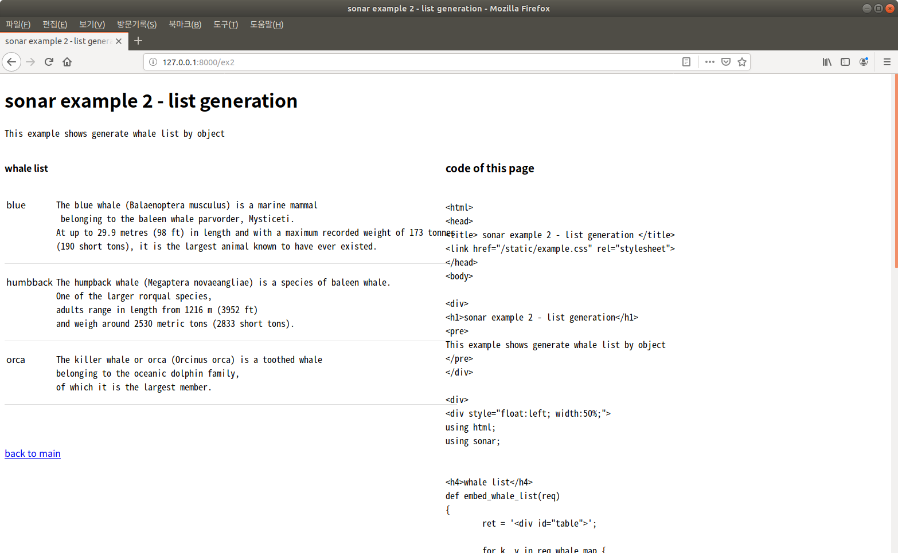
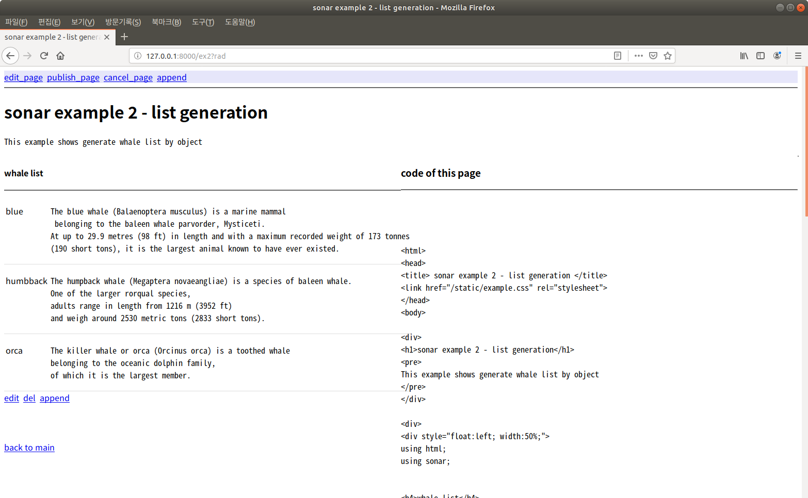
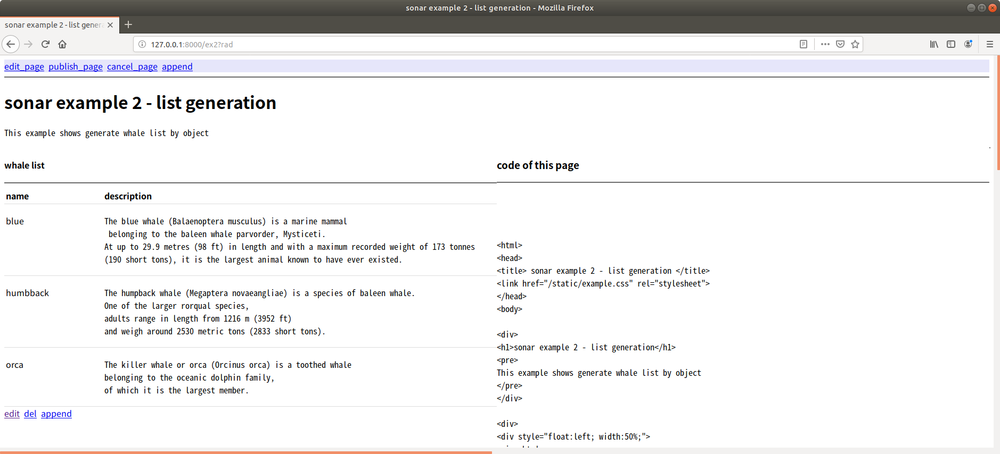
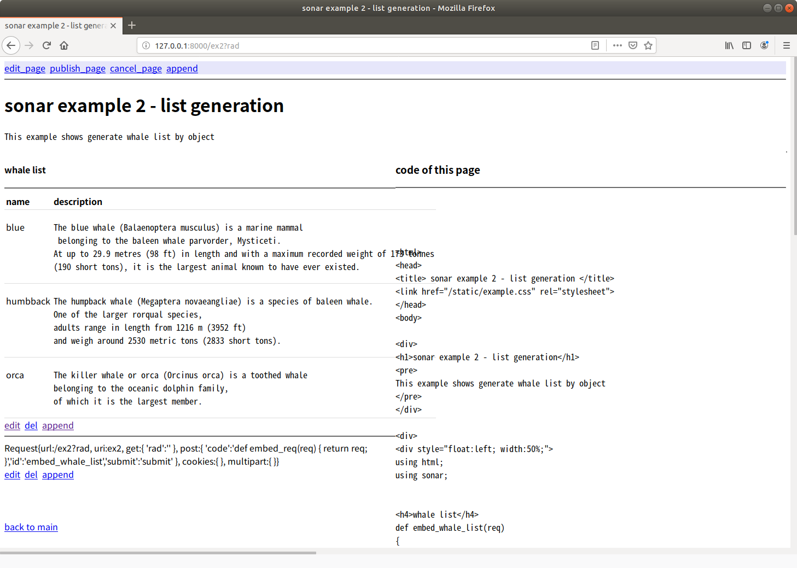

## RAD web development of Orca Sonar

This document describes RAD web development of orca sonar. I recommend to read 10 minutes introduction first.

### Overview of Sonar and context extended object

Rails and Django use templates to build result web page. Those make logic parts of page by view function and pass to template and compose final result.

This kind of method is easy to use but it's done by one function. 
We can assume those logic parts as objects. If so, Result page and program structure has 1:1 mapping and easy to understand.

You can see the that kind of advantage by last chapter of below link.

<https://github.com/lynix94/orca-lang/blob/master/docs/10min.md>


It uses html context extended object which can contain logic parts as an embedded object (Orca language can do this)

Below link is an example which contains embed_whale_list object in ex2.orca.html object source code. 

<https://github.com/lynix94/sonar-example/blob/master/ex2.orca/index.orca.html>


This method has more readability because it keeps logic structure in its code.

And more useful functions can be made by indirect layer. Next chapter show rad mode as one example.


### RAD mode of html

RAD mode of Orca html module means that developer can modify object of page directly. This is similar with RAD GUI programming in usage but an architecture which make that possible is very different.

RAD GUI programming assume meta data like XML. and combine that with event driven function. So, view object in development stage is not real one.

The RAD web development of orca html module uses different method. It generates additional links which can edit, del and append object if there is rad parameter when it generates page.

So, it generates page with same logic with real one. (except additional links)


### Implementation

Below link and code is the second example orca sonar-example (It is referred in 10 minutes introduction)

<https://github.com/lynix94/sonar-example/blob/master/ex2.orca/index.orca.html>

```
...

<div>
<h1>sonar example 2 - list generation</h1>
<pre>
This example shows generate whale list by object
</pre>
</div>

<div>
<div style="float:left; width:50%;">
using html;
using sonar;


<h4>whale list</h4>
def embed_whale_list(req)
{
	ret = '<div id="table">';

	for k, v in req.whale_map {
		ret += '<div class="row">';
		ret += '<span class="cell col1">%s</span><span class="cell col2"><pre>%s</pre></span>' % (k, v);
		ret += '</div>';
	}
	ret += '</div>';
	return ret;
}

<br><br><br><a href="/">back to main</a>
</div>
...
```


Below screenshot is the result of above page.




Blue whale, humpback whale and orca list are generated on the left part of page. This list is the result of embed_whale_list object in the source code. 


Then if you change the url of this page like below,

`127.0.0.1:8000/ex2?rad`

Page is generated like below.





Generated Three links are appended after whale list. If you click edit link, The page is changed like below.


The embed_whale_list object is now shown with it's source code in the edit box (not as a generated result). If you change the source code and click submit link, the page is changed at that time.

As an example, Add label text (name, description) as an top row like below 


Above change make below result after submitting.



Other links, 'del' make the object disappear. 'append' make new empty edit box which can make new object after that.
Below shows make embed_req object from 'append' link. embed_req just return url request. (and it will be displayed to page as an string)


Submitting make below page. Now we can see url request on the page. You can use information object like this and remove that object before page publishing.





The title bar on the top of page enable 'edit', 'publish' or 'cancel' of this page.

If you click 'edit' at this time.


Like above, Whole page source code is displayed in the edit box.

You can see the code of embed_whale_list is changed and embed_req is appended by previous editing.


### Conclusion

I'd like to say again that Orca's object structure is very flexible and with context extended object, many things can be made easily like above example.

Think about this, if you add new function like 'edit box' of object on the page. That means the change of basic design & architecture. But in case of orca, only one layer which render additional link make it possible easily.

Now this aspect is on prototype stage. Improvement of front-end part is needed to provide convenience on editing (like highlighting). And other debugging tools on page will be added later.

Prevent editing from unauthorized IP will be possible for security reason. But this aspect will be not restricted on development side only. 

In Orca there is context extended object. so, developer can allow limited context extended object only. As an example, there is markdown md object in orca. So markdown editing and embedding to page is possible with above method (not by full implementation of it as an application)

Next time, many other interesting things will be back.

You can see full video clip & demonstration by below link.

### TODO: add link

Thanks for reading.


