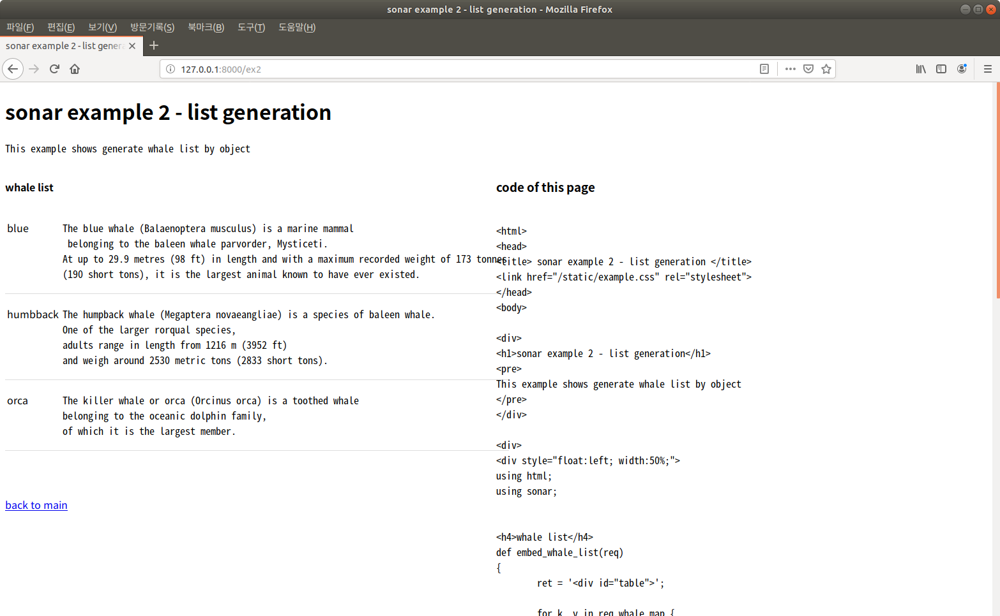
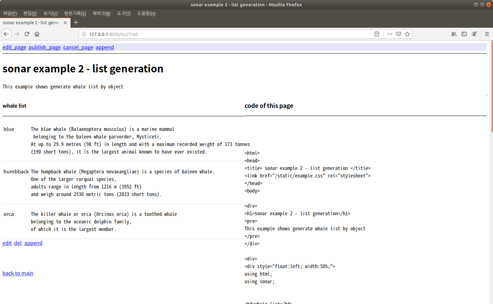
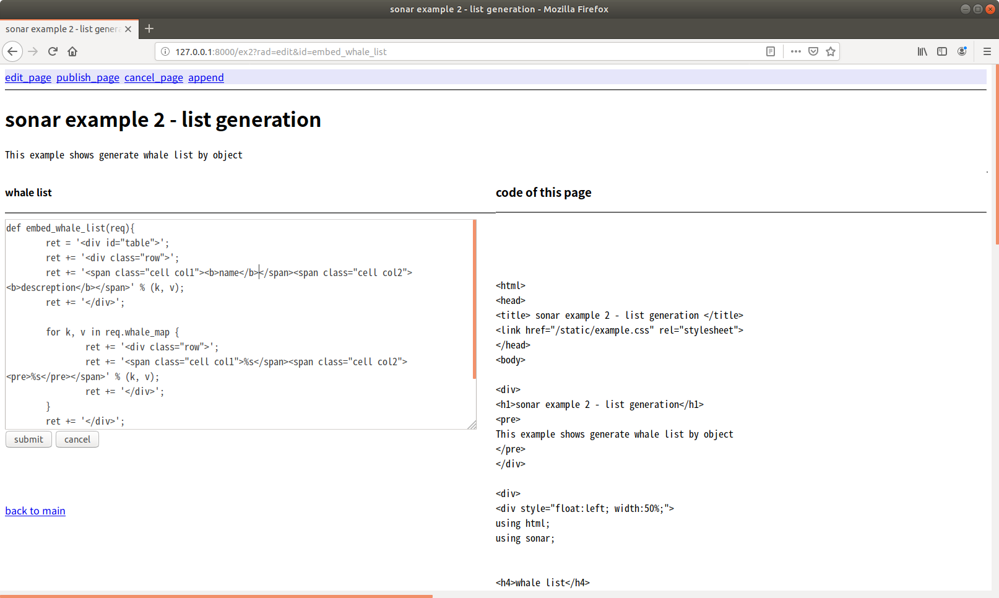
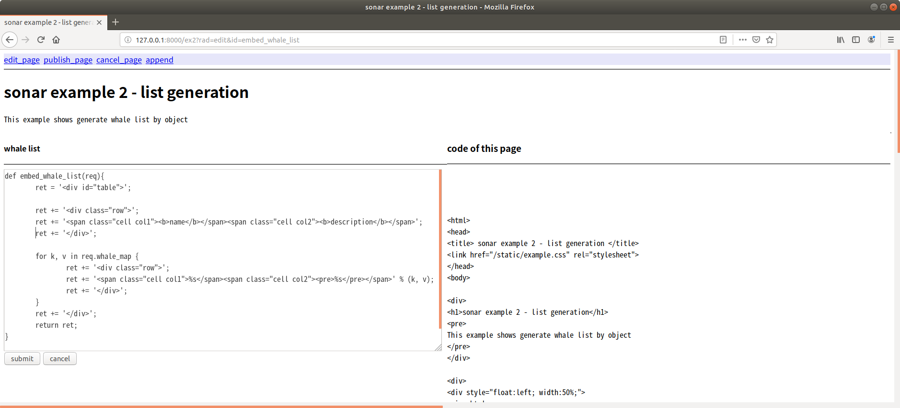
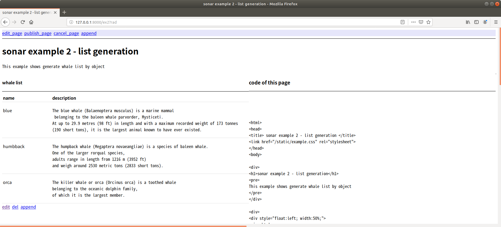
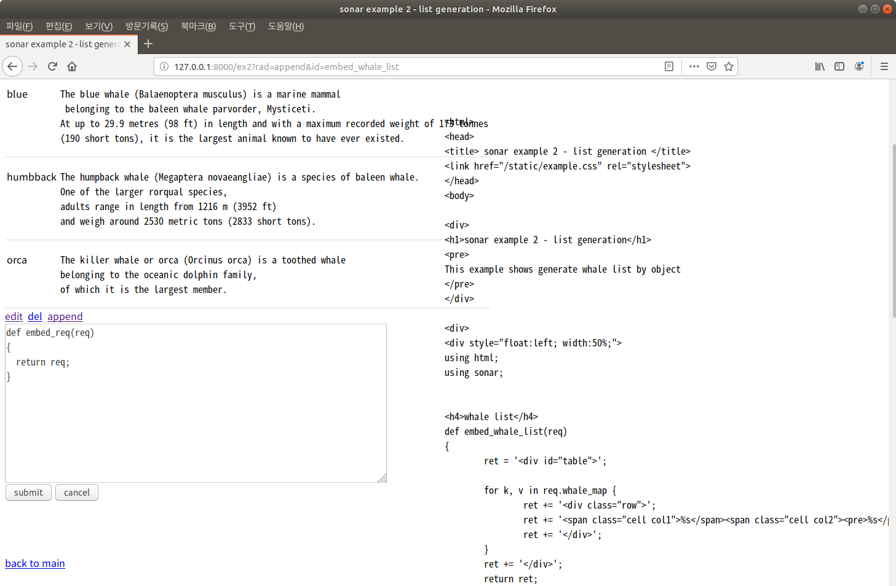
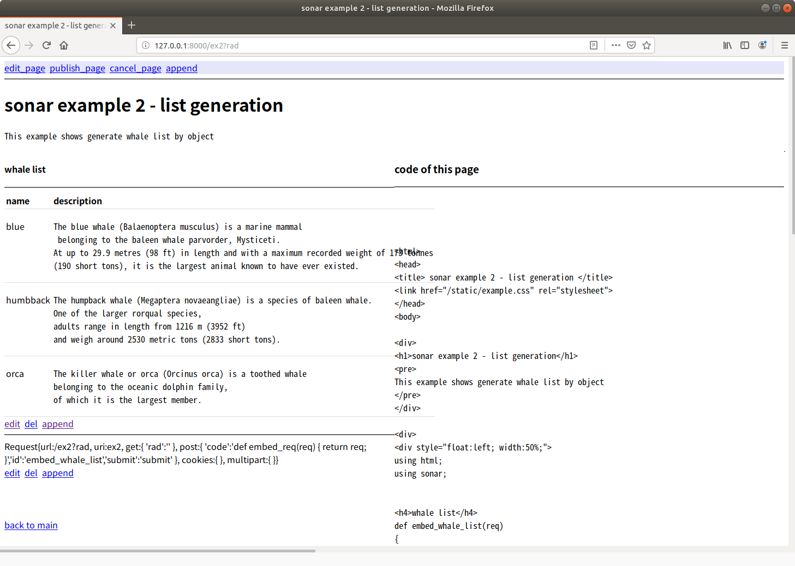
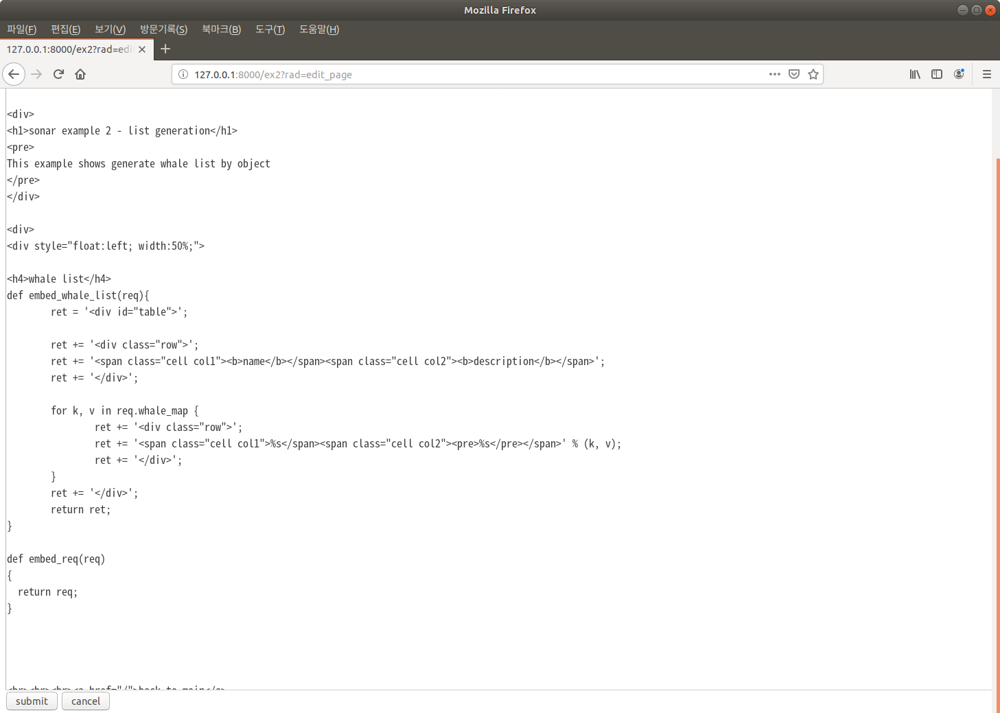

## Orca Sonar 의 RAD 모드


이 문서는 오르카 sonar 의 rad 모드에 대한 간략한 설명이다.
이 문서를 보기전에 10 분 가이드를 먼저 보기를 권한다.

### sonar 와 문맥확장 객체 오버뷰

쉬운 웹개발을 위해 rails, django 의 프레임웍은 최종 결과물이 될 페이지를 구성할 템플릿을 만들고 이 템플릿 중 로직으로 구성되는 부분을 view 객체에서 처리한 후 파라미터로 전달하여 합성하는 방식이다.
이 방식은 사용하기 편하지만 템플릿에 사용할 파라미터를 구성하는 방식이 별도의 함수에 의해 절차적으로 실행된다.

템플릿에 끼워지는 항목들을 로직이 있는 객체로 볼 수 있고, 이렇게 하면 최종 결과물과 프로그램의 구조가 직관적으로 연결되는 장점이 있다. 이 부분은 10분 가이드의 마지막 부분에 잘 설명되어 있다.

<https://github.com/lynix94/orca-lang/blob/master/docs/10min_kr.md>


간략히 설명하면 템플릿을 사용하지 않고, html 문맥확장객체를 정의하되 이 객체안에 각각의 임베딩될 객체들이 포함되게 구성할 수 있다. (오르카 언어 특성상 문맥확장 객체에서 이게 가능하다)

아래는 고래 목록을 출력하는 embed_whale_list 라는 객체가 ex2.orca.html 이라는 문맥확장객체 소스안에 포함되어 있는 코드이다. 10분 가이드에서 설명하고 있지만 일단 간단히 보고 지나가자.

<https://github.com/lynix94/sonar-example/blob/master/ex2.orca/index.orca.html


이렇게 하면 결과물과 프로그램의 구조가 상호 연관성을 가지게 되어 가독성이 뛰어나다.
그리고 이 구조가 유지되기 때문에, 개별 멤버객체들의 결과값을 임베딩하는 과정에 하나의 간접 레이어를 둠으로써 많은 활용성을 가질 수 있다. 

다음 장에서는 이의 한 예로서 rad mode 를 살펴보겠다.


### html 모듈의 rad mode 란...

오르카 html 모듈의 rad 모드란, html 객체를 개발하는 단계에서 화면상의 표현 로직을 직접 수정하는 방법을 말한다. 이는 기존 GUI 프로그래밍에서 IDE 에서 지원하는 RAD 개발 방식과 유사하지만 이 기능이 구현되는 방식은 차이가 많다.


기존 GUI 프로그래밍은 xml 등의 메타 데이터를 가정하고, 이 것과 이벤트 드리븐으로 구동되는 로직을 연결하는 방식으로 구성된다. 때문에 개발단계에서 보여지는 화면은 실제 동작하고 있는 화면이 아니다. 

orca html 모듈의 rad 개발 방식은 html 객체가 임베딩된 멤버들을 최종 결과물로 구성할 때 rad 파라미터가 있으면 이 객체를 수정할수 있는 링크, 방법을 같이 렌더링해 화면에 추가로 표시하는 방식이다.

때문에, 개발단계에서 사용하는 화면은 실제 응용과 동일한 로직으로 돌아가는 화면이다. (부가 정보만 더 포함될 뿐이다)


### 동작 방식

먼저 sonar-example 의 두번째 예제는 아래와 같다. (10분 가이드에서 언급된다)

<https://github.com/lynix94/sonar-example/blob/master/ex2.orca/index.orca.html

```
...

<div>
<h1>sonar example 2 - list generation</h1>
<pre>
This example shows generate whale list by object
</pre>
</div>

<div>
<div style="float:left; width:50%;">
using html;
using sonar;


<h4>whale list</h4>
def embed_whale_list(req)
{
	ret = '<div id="table">';

	for k, v in req.whale_map {
		ret += '<div class="row">';
		ret += '<span class="cell col1">%s</span><span class="cell col2"><pre>%s</pre></span>' % (k, v);
		ret += '</div>';
	}
	ret += '</div>';
	return ret;
}

<br><br><br><a href="/">back to main</a>
</div>
...
```

이 프로그램을 실행시킨 결과는 아래와 같다.




페이지 왼쪽에 blue whale, humpback whale, orca 의 이름과 설명에 대한 목록이 생성되어 페이지에 포함되어 있다. 이 목록은 embed_whale_list 객체이다. 


이제 이 페이지의 url 파라미터를 아래와 같이 변경하면

`127.0.0.1:8000/ex2?rad`

페이지가 아래와 같이 렌더링된다.





generation 된 whale list 밑에 세 개의 링크가 추가로 생겼다. edit 를 누르면 화면이 아래와 같이 변경된다.




고래 목록에 해당되는 객체 embed_whale_list 가 렌더링된 결과가 아닌 소스코드가 에디트 박스에 나타난다. 이 코드를 수정하고 submit 을 누르면 실시간으로 반영된다.

예를 들어 아래와 같이 목록의 맨 위에 라벨을 붙이게 코드를 추가하고 (name, description row 를 추가했다)




submit 을 누르면 페이지가 아래와 같이 변경된다.




edit 외의 다른 링크들, del 을 누르면 해당 객체가 사라지고 append 를 누르면 해당 객체의 다음 위치에 다른 객체를 삽입할 수 있다. 아래 그림과 같이 append 를 누르고 url request 객체를 반환하는 embed_req 객체를 정의했다.




그리고 submit 을 누르면 아래와 같이 url request 객체가 화면에 나타난다. 이제 웹 개발을 할 때 url request 등의 값을 debug print 할 필요없이 화면에 출력시켰다가 publish 전에 삭제할 수 있다.



 

페이지의 맨 위에는 타이틀 바가 하나 생긴것을 알 수 있는데, 전체 페이지에 대한 edit 나 publish, cancel 을 할 수 있다.

현재까지 개발된 상황에서 edit 를 누르면



위와 같이 이페이지의 내용이 editbox 에 나타난다. 

코드를 잘 보면  embed_whale_list 의 안의 코드가 아까 변경된 것이 반영되어 있고, 그 아래에 embed_req 가 추가된 것을 알 수 있다.


### 마치며

마치며 강조하고 싶은 것은, orca 는 구조상 프로그램의 논리적인 부속품과 1:1 로 대응하도록 객체 구조를 구성할 수 있고 이 일관성이 rad 모드 등과 같은 응용을 쉽게 적용할 수 있게 해준다는 점이다. 만일 템플릿 방식으로 웹 프로그램을 작성하고난 후, 객체 중 일부를 화면에서 수정하는 기능을 추가하겠다는 건 프로그램을 완전히 새로 만드는 수준의 변경이 되어야 할 것이다. 하지만 오르카에서는 html 객체가 멤버로 가지고 있는 표현 객체들(embed_whale_list 등) 을 렌더링하면서 하나의 간접층 만으로 쉽게 구현가능했다.

현재 rad 기능은 sonar 의 프로토타입 단계이다. edit 시의 수정환경에 대한 front end 단 개선이 필요하고, 개발 단계에서의 디버깅 지원을 위한 기능들이 더 들어갈 예정이다.

보안상의 문제를 해결하기 위해 개발단계 및 인증된 IP에서만 rad 파라미터를 적용하게 할 수 있는 것도 물론 포함될 예정이며,

궁극적으로는 사전 제한된 객체만을 사용자가 추가, 편집하게 할 수 있게 함으로써 사용자 생성 객체를 페이지에 쉽게 반영하는 방법도 고려중이다. 예를들어 화면에서 마크다운 파일을 편집하는 기능을 구현하려면 구 방식에서는 해당 편집, 반영 기능을 구현해야 하지만, 오르카에서는 markdown 문맥확장객체를 하나 정의하고, rad 와 유사한 방식으로 쉽게 구현할 수 있다.

다음번에 더 재미있는 기능으로 돌아오겠다.


이 문서의 내용은 아래 링크의 강좌로 실제 동작 및 좀 더 상세한 내용과 같이 둘러볼 수 있다.

https://youtu.be/4za66tnja78


